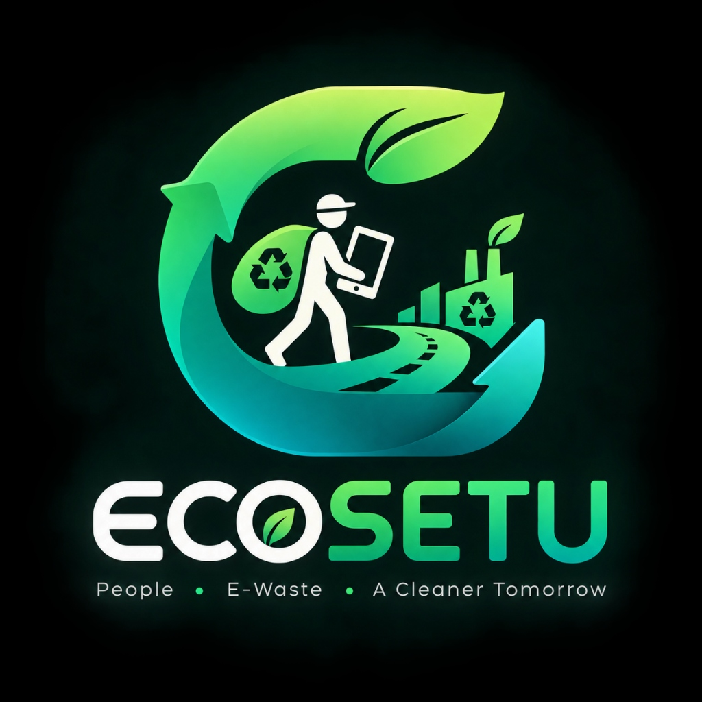

<p align="center">
  
</p>

<h1 align="center">ECOSETU</h1>

<p align="center">
  <strong>Bridging the Informal E-Waste Collector into the Formal Circular Economy</strong><br>
  <em>A Voice-First, Vernacular-Powered Digital Platform for Traceable E-Waste Sourcing & EPR Compliance</em>
</p>

<p align="center">
  <a href="https://github.com/alokkumar-gh/ecosetu/releases/latest"></a>
  <a href="https://reactnative.dev/"></a>
  <a href="https://nodejs.org/"></a>
  <a href="https://bhashini.gov.in/"></a>
  <a href="LICENSE"></a>
</p>

---

## Overview

In India, over **95% of e-waste** is collected through the informal sector (itinerant waste buyers / kabadiwalas and local aggregators). These collectors often lack digital tools, formal market access, and safety equipment, while formal recyclers struggle with fragmented supply chains and compliance under Extended Producer Responsibility (EPR) regulations.

**ECOSETU** is a production-grade digital platform that formalizes the informal e-waste collection ecosystem. It equips low-literacy informal collectors with a **voice-first, multilingual mobile interface**, connects them directly with authorized recyclers, and guarantees tamper-evident chain-of-custody tracking.

---

## Core Problem & Solution

```
┌─────────────────────────────────────────────────────────────┐
│                       THE CHALLENGE                         │
├──────────────────────────────┬──────────────────────────────┤
│ Informal Collectors          │ Formal Recyclers             │
│ • Low-literacy / non-English │ • Under-capacity operations  │
│ • Opaque scrap pricing       │ • Fragmented sourcing        │
│ • Hazardous handling risks   │ • Incomplete EPR audit trail │
└──────────────────────────────┴──────────────────────────────┘
                               │
                               ▼
┌─────────────────────────────────────────────────────────────┐
│                     THE ECOSETU BRIDGE                      │
├─────────────────────────────────────────────────────────────┤
│ 🔊 Vernacular Voice Engine (BHASHINI Indic ASR/TTS/TLD)     │
│ 📊 Real-Time Fair Market Price Board per kg                 │
│ 📦 Digital Lot Aggregation & Direct Recycler Quotations     │
│ 🤝 Scale-Verified Digital Handover & Instant Receipts       │
│ 🛡️ Pictorial Safety Center & Multilingual Audio Guides      │
│ 🤖 EcoSaathi Conversational Voice Assistant                 │
└─────────────────────────────────────────────────────────────┘
```

---

## Key Features

### 👥 1. Collector-First Experience
- **First-Launch Language Onboarding**: Native script selection (`ଓଡ଼ିଆ`, `हिन्दी`, `मराठी`, `English`) with spoken greeting and interactive voice testing.
- **Voice-Enabled Material Discovery**: Tap-to-speak interface allowing collectors to record scrap materials in local dialects.
- **Page-Wise Voice Guidance (`PageVoiceGuide`)**: Concise, colloquial 2–3 sentence spoken explanations across all core screens (Dashboard, Earnings, Price Board, Pickups, Lots, Handover, Safety Center).
- **Price Discovery Board**: Transparent scrap benchmark rates per kilogram (mobile phones, motherboards, CRT glass, lithium batteries).
- **Digital Handover & Scale Matching**: Real-time physical scale weight entry, variance alerts, and tamper-evident digital transfer receipts.
- **Low-Literacy Safety Center**: Pictorial hazard guides for swollen lithium cells, mercury lamps, and CRT picture tubes with spoken vernacular safety advice.

### 🤖 2. EcoSaathi Voice Assistant
- Voice chatbot powered by **BHASHINI ASR, NMT, and TTS**.
- Allows collectors to ask questions by speaking naturally in Odia, Hindi, Marathi, or English.
- Auto-speak preference toggle (`🔊 Voice: ON / OFF`) with per-message on-demand **Listen** controls.

### 🏢 3. Recycler Sourcing & EPR Compliance
- B2B scrap lot bidding, batch ingestion manifests, and verifiable chain-of-custody ledgers.
- End-to-end traceability required for Central Pollution Control Board (CPCB) EPR compliance.

### 🏛️ 4. Executive Control Center (`AdminShell`)
- Verification queue for collector Aadhaar/UPI and recycler facility licenses.
- System diagnostics, geographic coverage analytics, and dispute audit logging.

---

## BHASHINI Multilingual Voice Engine

ECOSETU integrates the Government of India's **BHASHINI** (MeitY) Dhruva infrastructure as its centralized voice and translation engine.

### Supported Languages

| Language | Code | Native Script | ASR (Speech-to-Text) | TTS (Text-to-Speech) | TLD (Language Detect) | NMT (Translation) |
| :--- | :---: | :---: | :---: | :---: | :---: | :---: |
| **Odia** | `or` | ଓଡ଼ିଆ | ✓ Live | ✓ Live | ✓ Live | ✓ Live |
| **Hindi** | `hi` | हिन्दी | ✓ Live | ✓ Live | ✓ Live | ✓ Live |
| **Marathi** | `mr` | मराठी | ✓ Live | ✓ Live | ✓ Live | ✓ Live |
| **English** | `en` | English | ✓ Live | ✓ Live | ✓ Live | ✓ Live |

### Optical Character Recognition (OCR) Status
> [!NOTE]
> OCR functionality is currently **pending BHASHINI account/service activation**. The OCR pipeline remains strictly isolated and does not affect voice or vernacular services.

---

## Architecture

```
┌─────────────────────────────────────────────────────────────┐
│                 ECOSETU Mobile Client (Android)             │
│    (VoiceInput · PageVoiceGuide · EcoSaathi · Multi-Locale) │
└──────────────────────────────┬──────────────────────────────┘
                               │ REST / Bearer Token
                               ▼
┌─────────────────────────────────────────────────────────────┐
│                     ECOSETU Backend Engine                  │
│    (Node.js + Express · Prisma · LRU Caching · Security)    │
└──────────────────────────────┬──────────────────────────────┘
                               │ Server-to-Server HTTPS
                               ▼
┌─────────────────────────────────────────────────────────────┐
│                 BHASHINI Dhruva Inference API               │
│   (ASR Speech Recognition · Indic TTS · NMT · TLD Engine)   │
└─────────────────────────────────────────────────────────────┘
```

### Voice Chat Workflow
```
Collector Speaks (Odia/Hindi/Marathi/English)
  ↓
BHASHINI ASR (Audio → Text)
  ↓
ECOSETU Backend (Intent Resolution & Dynamic Sourcing Data)
  ↓
BHASHINI TTS (Text → Spoken Vernacular Audio)
  ↓
Collector Hears Natural Audio Response
```

---

## Security Model

- **Zero Client-Side Key Exposure**: All `BHASHINI_INFERENCE_API_KEY`, `BHASHINI_USER_ID`, and database credentials reside exclusively on the server.
- **Strict `.gitignore` Protection**: Local `.env` files are never tracked or committed.
- **Deterministic Audio Caching**: SHA-256 hashed LRU in-memory cache for static UI explanations to reduce bandwidth and latency ($<2\text{ms}$ response time).

---

## Technology Stack

| Layer | Technologies |
| :--- | :--- |
| **Mobile Client** | React Native 0.78, TypeScript, React Navigation, Native Sound & Speech Modules |
| **Backend Service** | Node.js, Express.js, Prisma ORM, PostgreSQL |
| **Voice & Vernacular** | BHASHINI Dhruva API (MeitY, Government of India), Indic Coqui TTS, Whisper/Conformer ASR |
| **UI & Accessibility** | Custom High-Contrast Dark Slate Design System, Accessible Vector Icons (>= 48dp–64dp touch targets) |

---

## Automated Verification Status

All core modules undergo automated verification before releases:

```bash
# 1. Mobile TypeScript compilation (0 errors)
npm run typecheck --prefix mobile

# 2. Vernacular language & persistence test (23/23 tests passed)
node backend/tests/verify_vernacular_language.js

# 3. BHASHINI integration architecture test (8/8 tests passed)
node backend/tests/verify_bhashini_integration.js
```

> [!IMPORTANT]
> **Validation Notice**: Automated integration, syntax, and live API pipeline verifications are completed. Physical ground validation with human informal collectors remains scheduled for field trial phases.

---

## Project Structure

```plaintext
EcoSetu/
├── backend/                   # Node.js + Express REST API Gateway
│   ├── src/
│   │   ├── controllers/       # Business logic (voice, language, collectors, recyclers)
│   │   ├── routes/            # REST endpoints (/api/v1/voice, /api/v1/language)
│   │   ├── services/          # bhashiniService.js and domain services
│   │   └── middlewares/       # Auth, rate limiting, and sanitization
│   ├── prisma/                # Relational schema and migrations
│   └── tests/                 # Automated verification test suites
├── mobile/                    # React Native Android application
│   ├── src/
│   │   ├── components/        # VoiceInput, PageVoiceGuide, EcoSaathi, AppIcon
│   │   ├── i18n/              # 4-language dictionaries (en, hi, mr, or)
│   │   ├── screens/           # Collector, Citizen, Recycler, and Admin screens
│   │   └── services/          # voiceService.ts, bhashiniClientService.ts
│   └── android/               # Native Android build configurations
├── docs/                      # Comprehensive architecture and audit reports
│   ├── BHASHINI_INTEGRATION.md
│   ├── BHASHINI_LIVE_VERIFICATION_REPORT.md
│   └── COLLECTOR_VOICE_UX_AUDIT.md
└── assets/                    # Platform branding and icons
```

---

## Getting Started

### Prerequisites
- Node.js $\ge 18.x$
- PostgreSQL $\ge 14.x$
- Java Development Kit (JDK 17) & Android SDK (API Level 34+)

### 1. Backend Setup
```bash
cd backend
npm install
cp .env.example .env
# Configure DATABASE_URL and BHASHINI credentials in .env
npx prisma migrate dev
npm run dev
```

### 2. Mobile App Setup
```bash
cd mobile
npm install
cp .env.example .env
npm run android
```

---

## License

This project is licensed under the MIT License — see the [LICENSE](LICENSE) file for details.
