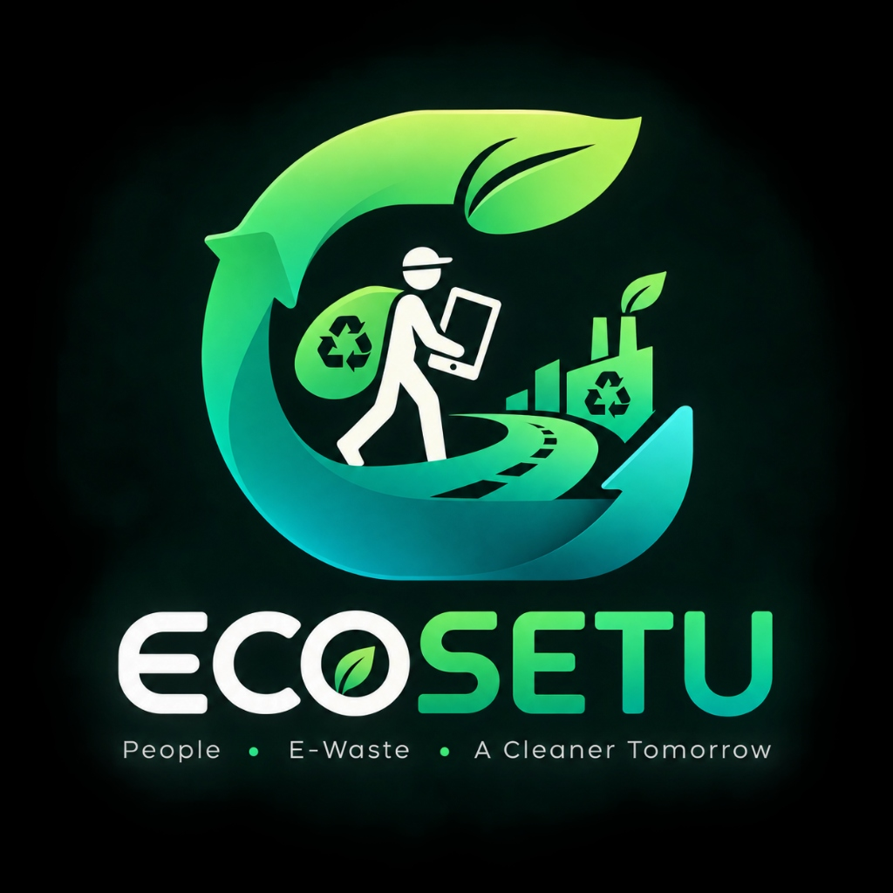
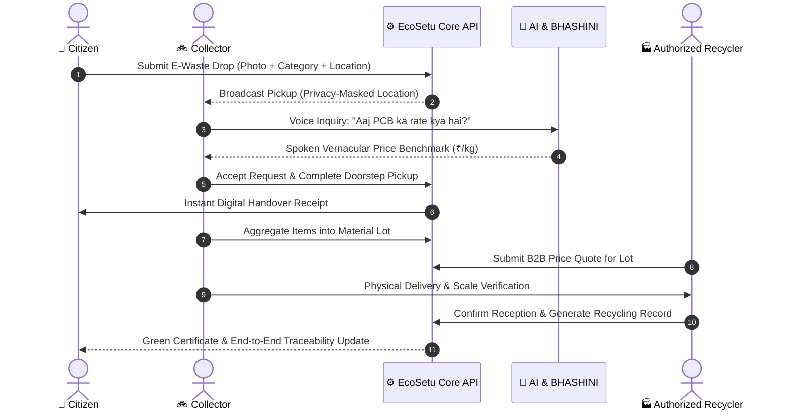
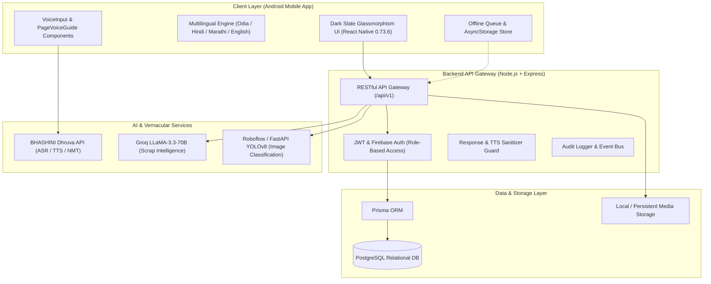

<p align="center">
  
</p>

<h1 align="center">ECOSETU (इकोसेतु / ଇକୋସେତୁ)</h1>

<p align="center">
  <strong>Bridging Informal E-Waste Collectors into India's Formal Circular Economy</strong><br>
  <em>A Voice-First, Vernacular-Powered Digital Platform for Traceable E-Waste Sourcing, Fair Valuation & EPR Compliance</em>
</p>

<p align="center">
  
  
  
  
  
  
  
</p>

---

## 📌 1. Project Overview

In India, **over 95% of electronic waste (e-waste) is collected through the informal sector** — itinerant scrap buyers (*kabadiwalas*), local aggregators, and waste pickers. Despite their pivotal role in recovery, informal collectors face systemic barriers:
- **Low English literacy and digital exclusion**: Existing enterprise tools are complex and text-heavy.
- **Opaque scrap pricing**: Asymmetric market rates lead to exploitation by middlemen.
- **Hazardous handling risks**: Dismantling toxic CRT tubes, lithium batteries, and acid leaching without safety guidance.
- **Fragmented supply chain**: Formal recyclers operate under capacity because they lack traceable sourcing channels to meet **Extended Producer Responsibility (EPR)** quotas mandated by the Central Pollution Control Board (CPCB).

**EcoSetu** is a production-grade digital platform engineered to formalize this informal supply chain. By pairing a **voice-first, multilingual interface** with **AI-assisted scrap valuation**, **offline-first state machines**, and **cryptographic chain-of-custody tracking**, EcoSetu empowers grassroot collectors, connects them directly with authorized recyclers, and establishes an auditable lifecycle for every kilogram of collected e-waste.

---

## 🏆 2. Smart India Hackathon (SIH) Context

- **Theme**: Clean & Green Technology / Sustainable Waste Management
- **Problem Statement**: Enabling digital inclusion, fair compensation, and traceable formalization for informal e-waste collectors while establishing verifiable Extended Producer Responsibility (EPR) audit trails for authorized recyclers.

### The Problem vs. Solution Paradigm

```
┌─────────────────────────────────────────────────────────────────────────┐
│                           THE GROUND REALITY                            │
├────────────────────────────────────┬────────────────────────────────────┤
│ Informal Collectors (Kabadiwalas)  │ Formal Authorized Recyclers        │
│ • Low literacy & non-English       │ • Incomplete EPR compliance trails │
│ • Arbitrary pricing & middleman cuts│ • Sub-optimal plant capacity      │
│ • Toxic exposure & safety hazards  │ • Fragmented feedstock sourcing    │
└────────────────────────────────────┴────────────────────────────────────┘
                                  │
                                  ▼
┌─────────────────────────────────────────────────────────────────────────┐
│                           THE ECOSETU BRIDGE                            │
├─────────────────────────────────────────────────────────────────────────┤
│ 🔊 Vernacular Voice Engine: Native Odia, Hindi, Marathi, & English     │
│ 📊 Real-Time Scrap Price Board: Transparent benchmark rates per kg     │
│ 📦 Digital Lot Aggregation & Direct Recycler Bidding                   │
│ ⚖️ Scale-Verified Handover: Dual-party weight matching & digital bills │
│ 🛡️ Low-Literacy Safety Center: Spoken vernacular hazard guidelines     │
│ 🤖 EcoSaathi Conversational AI: Voice assistant for scrap intelligence  │
└─────────────────────────────────────────────────────────────────────────┘
```

---

## 🚀 3. Key Implemented Features

### 👤 1. Citizen Portal
- **Zero-Friction Submission**: Multi-item e-waste drop requests with category selection, condition tag, doorstep location, and photo attachments.
- **Pickup Tracking & Offers**: Real-time status lifecycle (`SUBMITTED` ➔ `ACCEPTED` ➔ `PICKUP_SCHEDULED` ➔ `PICKED_UP`) with transparent collector offers.
- **Item Traceability & Green Certificate**: End-to-end chain-of-custody journey view showing when items are collected, consolidated into consignments, and safely processed by authorized recyclers.
- **Circular Store / Marketplace**: Browse and purchase certified refurbished electronics and working components with itemized digital tax invoices.

### 🚲 2. Informal Collector Portal (Collector-First Design)
- **First-Launch Vernacular Choice**: Native script onboarding supporting **Odia (`ଓଡ଼ିଆ`)**, **Hindi (`हिन्दी`)**, **Marathi (`मराठी`)**, and **English (`English`)**.
- **Voice Guidance (`PageVoiceGuide`)**: Spoken vernacular 2–3 sentence overview on every primary screen to assist low-literacy collectors.
- **Tap-to-Speak Search (`VoiceInput`)**: Spoken scrap material queries converted to text via BHASHINI ASR.
- **Scrap Price Discovery Board**: Real-time fair market benchmark rates per kilogram (circuit boards, mobile scrap, copper cables, lithium-ion cells, CRT glass).
- **Lot Management & Direct Quotations**: Aggregate collected items into unified material lots and receive competitive bids directly from verified recyclers.
- **Scale-Matched Handover Verification**: Physical scale weight input with tolerance variance alerts and cryptographic digital transfer receipts.
- **Vernacular Safety Center**: Illustrated hazard awareness and spoken audio guides for swollen lithium cells, mercury vapor lamps, CRT picture tubes, and lead-acid batteries.

### 🏭 3. Authorized Recycler Portal
- **Direct Sourcing & Marketplace Bidding**: Browse open material lots, evaluate purity/condition, and submit binding price quotes to collectors.
- **Consignment Reception & Weighbridge Verification**: Inspect inbound shipments, record certified weighbridge values, and reconcile declared vs. received weights.
- **EPR-Compliant Recycling Certificates**: Generate verifiable recycling completion records tagged with CPCB license numbers, batch weights, and recovered fraction breakdowns.
- **Recycler Rate Card**: Publish transparent daily procurement rates to incentivize high-grade scrap deliveries.

### 🛡️ 4. Executive Control Center (Admin Console)
- **Verification Queue**: Review and verify collector Aadhaar/identity proofs and recycler CPCB/SPCB operational licenses.
- **Factual System Health Diagnostics**: Real-time component status monitors for Database, AI Engine, BHASHINI Gateway, and Storage.
- **Geographic Coverage Analytics**: Geospatial visualization of collection densities, active regional clusters, and recycling plant capacities.
- **Dispute Resolution & Audit Trail**: Role-isolated grievance management for weight discrepancies and payment settlements.

### 🤖 5. EcoSaathi Voice Assistant
- Voice-enabled conversational AI assistant powered by **BHASHINI (ASR & TTS)** and **Groq LLaMA-3.3-70B**.
- Context-aware intent resolution for scrap prices, pickup schedules, safety warnings, and application navigation in regional languages and colloquial dialects (Hinglish, Marathi, Odia).

---

## 🗣️ 4. BHASHINI Vernacular Voice Engine

EcoSetu integrates the Government of India's **BHASHINI (Digital India Bhashini Division, MeitY)** infrastructure to deliver authentic voice interaction across Indic languages:

| Language | Code | Native Script | ASR (Speech-to-Text) | TTS (Text-to-Speech) | NMT (Translation) |
| :--- | :---: | :---: | :---: | :---: | :---: |
| **Odia** | `or` | ଓଡ଼ିଆ | ✓ Active | ✓ Active | ✓ Active |
| **Hindi** | `hi` | हिन्दी | ✓ Active | ✓ Active | ✓ Active |
| **Marathi** | `mr` | मराठी | ✓ Active | ✓ Active | ✓ Active |
| **English** | `en` | English | ✓ Active | ✓ Active | ✓ Active |

> [!NOTE]
> **Audio Optimization**: All static page explanations utilize a server-side SHA-256 in-memory LRU cache to reduce latency ($<2\text{ms}$ retrieval) and minimize external API overhead. On mobile devices, native on-device TTS is used as an instant offline fallback.

---

## 🔄 5. End-to-End User Workflow


```mermaid
sequenceDiagram
    autonumber
    actor Citizen as 👤 Citizen
    actor Collector as 🚲 Collector
    participant Backend as ⚙️ EcoSetu Core API
    participant AI as 🤖 AI & BHASHINI
    actor Recycler as 🏭 Authorized Recycler

    Citizen->>Backend: Submit E-Waste Drop (Photo + Category + Location)
    Backend-->>Collector: Broadcast Pickup (Privacy-Masked Location)
    Collector->>AI: Voice Inquiry: "Aaj PCB ka rate kya hai?"
    AI-->>Collector: Spoken Vernacular Price Benchmark (₹/kg)
    Collector->>Backend: Accept Request & Complete Doorstep Pickup
    Backend->>Citizen: Instant Digital Handover Receipt
    Collector->>Backend: Aggregate Items into Material Lot
    Recycler->>Backend: Submit B2B Price Quote for Lot
    Collector->>Recycler: Physical Delivery & Scale Verification
    Recycler->>Backend: Confirm Reception & Generate Recycling Record
    Backend-->>Citizen: Green Certificate & End-to-End Traceability Update
```

---

## 🏗️ 6. System Architecture


```mermaid
graph TD
    subgraph Client ["Client Layer (Android Mobile App)"]
        UI["Dark Slate Glassmorphism UI (React Native 0.73.6)"]
        I18N["Multilingual Engine (Odia / Hindi / Marathi / English)"]
        Offline["Offline Queue & AsyncStorage Store"]
        VoiceComp["VoiceInput & PageVoiceGuide Components"]
    end

    subgraph API ["Backend API Gateway (Node.js + Express)"]
        Router["RESTful API Gateway (/api/v1)"]
        Auth["JWT & Firebase Auth (Role-Based Access)"]
        Sanitizer["Response & TTS Sanitizer Guard"]
        Audit["Audit Logger & Event Bus"]
    end

    subgraph Persistence ["Data & Storage Layer"]
        Prisma["Prisma ORM"]
        Postgres[(PostgreSQL Relational DB)]
        Media["Local / Persistent Media Storage"]
    end

    subgraph Intelligence ["AI & Vernacular Services"]
        Bhashini["BHASHINI Dhruva API (ASR / TTS / NMT)"]
        Groq["Groq LLaMA-3.3-70B (Scrap Intelligence)"]
        Vision["Roboflow / FastAPI YOLOv8 (Image Classification)"]
    end

    UI --> Router
    VoiceComp --> Bhashini
    Router --> Auth
    Auth --> Prisma
    Prisma --> Postgres
    Router --> Groq
    Router --> Vision
    Router --> Media
    Offline -.-> Router
```

---

## 💻 7. Technology Stack

| Layer | Technology | Purpose in EcoSetu |
| :--- | :--- | :--- |
| **Mobile Client** | React Native `0.73.6`, TypeScript `5.0` | Cross-role mobile application (Citizen, Collector, Recycler, Admin) |
| **Mobile Navigation** | React Navigation `6.x` (Bottom Tabs & Native Stack) | Smooth role-isolated screen transitions and tab shells |
| **Design System** | Custom Dark Slate Glassmorphism Theme | High-contrast accessible UI with $\ge 48\text{dp}$ touch targets |
| **Backend Framework** | Node.js `20+`, Express.js `4.19` | RESTful API gateway, business logic, validation, rate limiting |
| **Database & ORM** | PostgreSQL `14+`, Prisma ORM `5.14` | Relational schema, migrations, transactions, and indexing |
| **Authentication** | JSON Web Tokens (JWT) + Firebase Auth | Role-based access control (RBAC), phone OTP, Google Sign-In |
| **Voice & Speech** | BHASHINI Dhruva API (MeitY, GoI) | Multilingual ASR (Speech-to-Text) and Indic TTS (Text-to-Speech) |
| **AI Intelligence** | Groq API (LLaMA-3.3-70B-Versatile) | Conversational EcoSaathi reasoning and dynamic scrap valuation |
| **Computer Vision** | Roboflow E-Waste Model / FastAPI Microservice | E-waste category classification and recyclable component detection |
| **Offline Layer** | React Native AsyncStorage + NetInfo | Request queueing, price caching, and auto-sync on reconnect |
| **Push Notifications** | Firebase Cloud Messaging (FCM) | Cross-role lifecycle push alerts and status updates |

---

## 🧠 8. AI & Machine Learning Architecture

```
┌─────────────────────────────────────────────────────────────────────────┐
│                       ECOSETU AI INTEGRATION PIPELINE                   │
├─────────────────────────────────────────────────────────────────────────┤
│                                                                         │
│  1. VERNACULAR VOICE (BHASHINI Dhruva API)                              │
│     Collector Audio ➔ ASR (Speech-to-Text) ➔ EcoSetu Intent Parser      │
│     Structured Intent ➔ Backend Query ➔ Spoken Vernacular Audio (TTS)   │
│                                                                         │
│  2. SCRAP INTELLIGENCE (Groq LLaMA-3.3-70B)                            │
│     Collector / Citizen Query ➔ Context Builder (Live DB Prices)        │
│     ➔ LLaMA-3.3 Reasoning ➔ Response Sanitizer (Zero Markdown / Leak)  │
│                                                                         │
│  3. COMPUTER VISION & CLASSIFICATION (Roboflow / YOLOv8)                │
│     E-Waste Image ➔ Magic Byte Verification ➔ Inference API             │
│     ➔ Category Prediction (Phone, Laptop, PCB, Battery) + Confidence    │
│                                                                         │
└─────────────────────────────────────────────────────────────────────────┘
```

- **Zero-Hallucination Guardrails**: The conversational engine injects real-time PostgreSQL prices into LLM prompts. If market data is absent, the system explicitly reports that no current rate is established rather than synthesizing prices.
- **Output Sanitization**: The server-side `responseSanitizer` strips code markers, markdown asterisks, raw JSON wrappers, and internal tokens before sending speech payloads to TTS synthesizers.

---

## 📴 9. Offline-First Resilience

Informal waste collectors operate frequently in areas with intermittent cellular connectivity. EcoSetu implements an offline-first architecture:
1. **Local Persistent Cache**: Market price boards, vernacular language strings, active lot listings, and safety guides are cached locally in `@react-native-async-storage/async-storage`.
2. **Action Queue (`@ecosetu_offline_queue`)**: Offline item submissions, pickup completions, and lot creations are queued locally.
3. **Automatic Synchronization**: On network reconnection, the `citizenSyncService` and `collectorSyncService` replay queued actions against the backend.
4. **Idempotency & Conflict Guard (HTTP 409)**: All transactional updates verify state-machine transitions on the server to prevent race conditions or duplicate submissions.

---

## 🗄️ 10. Database Schema (Key Entities)

The PostgreSQL database (managed via Prisma ORM) enforces relational integrity across all roles:

```
User (Citizen / Collector / Recycler / Admin)
 ├── CollectorProfile (Vehicle, Service Area, GPS, Verification Proofs)
 ├── RecyclerProfile (Facility, CPCB License, Daily Capacity, Rates)
 ├── CollectionRequest (Doorstep pickup requests, GPS, items, status)
 ├── EwasteItem (Category, condition, weight, images, collection link)
 ├── MaterialLot (Consolidated scrap lot, purity, asking price, status)
 ├── Quote (Recycler B2B bid on material lots)
 ├── Handover (Dual-party scale matching verification & notes)
 ├── Transaction (Payment rail, escrow status, transaction hash)
 ├── TransactionBill (Official itemized bill & SHA-256 fingerprint)
 ├── RecyclingRecord (EPR certificate, CPCB record, recovered fractions)
 └── Notification (Role-targeted lifecycle alerts)
```

---

## 📂 11. Project Structure

```plaintext
EcoSetu/
├── backend/                       # Node.js + Express REST API Service
│   ├── src/
│   │   ├── config/                # Environment, database, & constants
│   │   ├── controllers/           # Domain controllers (auth, collector, recycler, etc.)
│   │   ├── middleware/            # Auth, rate limiting, error & upload security
│   │   ├── routes/                # REST endpoint routers (/api/v1/*)
│   │   ├── services/              # Business logic, BHASHINI, Groq AI, Traceability
│   │   ├── utils/                 # AppError, response helpers, TTS sanitizer
│   │   └── validators/            # Joi & express-validator schemas
│   ├── prisma/                    # Relational schema & canonical seed script
│   └── tests/                     # 70+ automated verification test suites
├── mobile/                        # React Native Android Mobile Application
│   ├── src/
│   │   ├── components/            # GlassCard, VoiceInput, PageVoiceGuide, TopAppBar
│   │   ├── data/                  # Safety guidance & multilingual knowledge base
│   │   ├── hooks/                 # useAuth, useI18n, useVoiceAssistant
│   │   ├── i18n/                  # 4-locale dictionaries (en, hi, mr, or)
│   │   ├── navigation/            # Root, Citizen, Collector, Recycler, Admin navigators
│   │   ├── screens/               # Role-specific UI screens
│   │   ├── services/              # API clients, offline queue, sync, voice engine
│   │   ├── theme/                 # Dark glassmorphism color palette & spacing
│   │   └── types/                 # TypeScript interfaces & domain models
│   └── android/                   # Native Android gradle configurations & speech bridge
├── ai/                            # Python FastAPI e-waste vision microservice
├── docs/                          # Architecture specifications, API docs, & UAT reports
├── scripts/                       # Developer verification & build scripts
├── assets/                        # Logo and visual branding assets
├── .env.example                   # Master environment configuration template
├── docker-compose.yml             # Containerized multi-service deployment
└── README.md                      # Project documentation & SIH master submission
```

---

## ⚙️ 12. Setup & Installation

### Prerequisites
- **Node.js**: $\ge 20.0.0$
- **npm**: $\ge 9.0.0$
- **PostgreSQL**: $\ge 14.0$ (Local instance or Cloud PostgreSQL)
- **Java Development Kit**: OpenJDK 17
- **Android SDK**: API Level 34+ (for Android builds)

---

### Step 1: Clone Repository
```bash
git clone https://github.com/alokkumar-gh/ecosetu.git
cd EcoSetu
```

---

### Step 2: Backend Configuration & Startup
```bash
cd backend
npm install

# Configure environment variables
cp .env.example .env
# Edit .env and supply your DATABASE_URL, JWT secrets, and API keys

# Generate Prisma client and apply database migrations
npx prisma generate
npx prisma migrate deploy

# (Optional) Seed development database with demo data
npx prisma db seed

# Start development API server
npm run dev
```
*Backend API service starts at `http://localhost:3001` (Health check: `http://localhost:3001/health`).*

---

### Step 3: Mobile Application Setup
```bash
cd ../mobile
npm install

# Configure mobile environment variables
cp .env.example .env
# Edit .env with API_BASE_URL (http://10.0.2.2:3001/api/v1 for Android Emulator)

# Start Metro bundler
npm start

# In a separate terminal, launch Android application
npm run android
```

---

### Step 4: (Optional) AI Vision Service Startup
```bash
cd ../ai
python -m venv .venv
source .venv/bin/activate   # On Windows: .venv\Scripts\activate
pip install -r requirements.txt
uvicorn src.main:app --host 0.0.0.0 --port 8000 --reload
```

---

## 🧪 13. Automated Test & Validation Status

The EcoSetu repository includes comprehensive automated test suites covering TypeScript type checking, multilingual parity, BHASHINI voice integration, security guardrails, and logistics state machines:

```bash
# 1. Mobile TypeScript Typecheck (0 compilation errors)
npm run typecheck --prefix mobile

# 2. EcoSaathi Conversational & Multilingual Matcher Tests (108/108 PASS)
npm run test:saathi --prefix mobile

# 3. Vernacular 4-Language Dictionary Parity & Persistence (23/23 PASS)
node backend/tests/verify_vernacular_language.js

# 4. Production Security & RBAC Enforcement Suite (11/11 PASS)
node backend/tests/verify_production_security.js

# 5. Full Application Multilingual Verification (54/54 PASS)
node scripts/verify_full_app_i18n.js

# 6. Collector Pickup Confirmation UI State Machine (24/24 PASS)
node scripts/verify_pickup_confirmation_ui.js

# 7. Navigation Export Integrity (5/5 PASS)
node scripts/verify_screens_import.js
```

---

## 🔒 14. Security, Privacy & Compliance

- **Zero Client-Side Secret Exposure**: API keys (`BHASHINI_INFERENCE_API_KEY`, `GROQ_API_KEY`, `ROBOFLOW_API_KEY`, `DATABASE_URL`) are isolated exclusively on the server.
- **Privacy Masking for Collectors**: Citizen phone numbers and precise street addresses remain masked until a collector formally accepts the pickup request.
- **File Upload Protection**: All image uploads undergo magic-byte signature validation to prevent malicious binary execution.
- **Role Isolation & Protected Fields**: Strict middleware prevents role tampering (`role` field cannot be modified via profile update endpoints).
- **CPCB EPR Traceability**: Handover records and bills generate SHA-256 integrity digests for non-repudiation during CPCB regulatory audits.

---

## ⚠️ 15. Known Limitations & Boundaries

1. **Optical Character Recognition (OCR)**: Identity document OCR pipeline is ready but remains in staging pending BHASHINI government account activation. Manual visual verification in Admin console is active.
2. **Physical Field Trials**: Automated pipeline verifications are 100% complete; physical human trials with local informal scrap aggregators are scheduled for field deployment phases.
3. **External Cloud AI Dependency**: Advanced natural language conversation utilizes Groq Cloud inference; when offline, the system seamlessly falls back to local rule-based intent matching.

---

## 🔮 16. Future Roadmap

- **Smart Weighing Scale IoT Integration**: Bluetooth (BLE) pairing with digital hanging scales to eliminate manual weight entry during doorstep collection.
- **Automated CPCB EPR Portal Integration**: Direct API dispatch of verified recycling manifests to state and central pollution control boards.
- **Offline Mesh Networking**: Peer-to-peer Wi-Fi Direct / Bluetooth synchronization between collectors and aggregators in zero-connectivity rural belts.
- **Expansion of Indic Languages**: Addition of Bengali, Telugu, Tamil, and Kannada voice models.

---

## 📜 17. License

This project is licensed under the **MIT License** — see the [LICENSE](LICENSE) file for complete details.

---

<p align="center">
  <strong>EcoSetu — Empowering the Informal Collector · Formalizing E-Waste · Protecting the Environment</strong><br>
  <em>Smart India Hackathon Submission</em>
</p>
