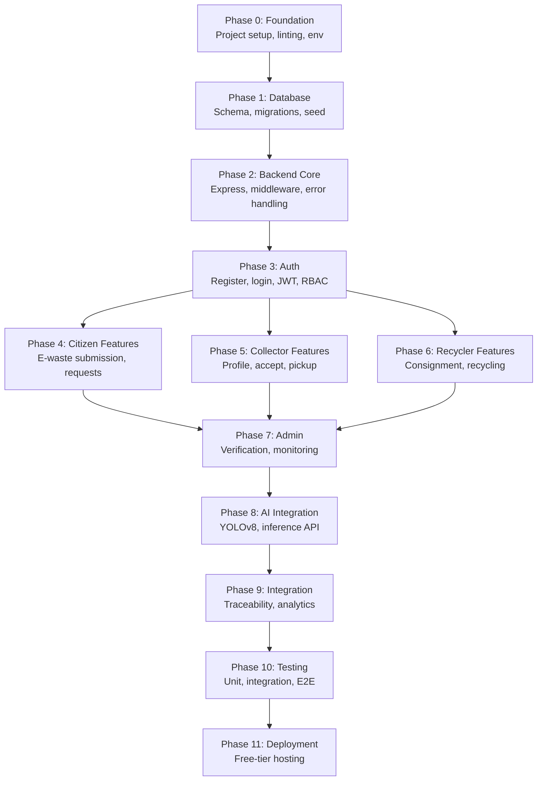
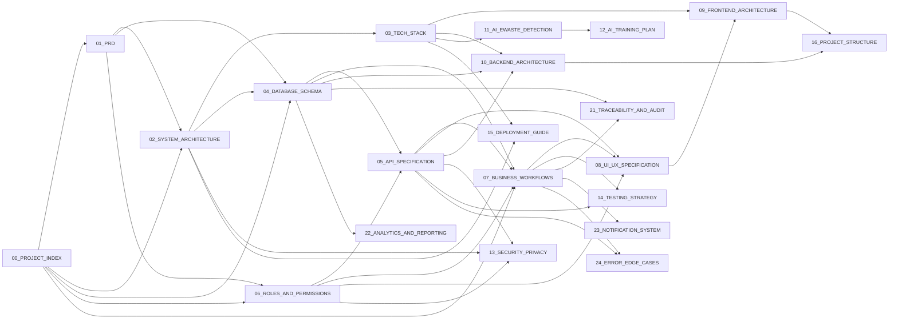

# EcoSetu — Project Index

> **Single Source of Truth** for the EcoSetu platform documentation.
> All other documents reference definitions established here.

---

## 1. Project Overview

**SIH Problem Statement:** 26229

**Title:** EcoSetu – Bringing the Informal Collector into the Formal Recycling Chain

**Objective:** Design an Android-first technology platform that integrates informal e-waste collectors (kabadiwalas) into a structured, traceable recycling ecosystem. The platform connects citizens who generate e-waste with verified informal collectors via an Android mobile app, who in turn deliver materials to authorized recyclers — creating end-to-end traceability.

**Target Platform:** Android Application (Primary MVP). Web application is marked as **FUTURE / DEFERRED**.

**Scope:** SIH prototype — functional Android application, demonstrable on physical Android devices/emulators, built with free/open-source tools by a student team.

---

## 2. Documentation Map

| # | File | Purpose | Dependencies |
|---|------|---------|-------------|
| 00 | `00_PROJECT_INDEX.md` | Master index, canonical terminology, dependency map | None |
| 01 | `01_PRD.md` | Product requirements, user stories, MVP scope | 00 |
| 02 | `02_SYSTEM_ARCHITECTURE.md` | System architecture, component diagram, data flow | 00, 01 |
| 03 | `03_TECH_STACK.md` | Technology choices with justifications | 00, 02 |
| 04 | `04_DATABASE_SCHEMA.md` | Complete database schema, ER diagram | 00, 01, 02 |
| 05 | `05_API_SPECIFICATION.md` | Full REST API contract | 00, 04, 06 |
| 06 | `06_ROLES_AND_PERMISSIONS.md` | RBAC definitions, permission matrix | 00, 01 |
| 07 | `07_BUSINESS_WORKFLOWS.md` | Business process flows | 00, 01, 04, 05, 06 |
| 08 | `08_UI_UX_SPECIFICATION.md` | UI/UX design specification per role | 00, 05, 06, 07 |
| 09 | `09_FRONTEND_ARCHITECTURE.md` | Frontend project architecture | 00, 03, 08 |
| 10 | `10_BACKEND_ARCHITECTURE.md` | Backend project architecture | 00, 03, 04, 05 |
| 11 | `11_AI_EWASTE_DETECTION.md` | E-waste image detection system design | 00, 03 |
| 12 | `12_AI_TRAINING_PLAN.md` | Practical AI model training plan | 00, 11 |
| 13 | `13_SECURITY_PRIVACY.md` | Security architecture, privacy, threat model | 00, 02, 05, 06 |
| 14 | `14_TESTING_STRATEGY.md` | Testing strategy, test cases, acceptance criteria | 00, 05, 07 |
| 15 | `15_DEPLOYMENT_GUIDE.md` | Deployment architecture, free-tier hosting | 00, 02, 03 |
| 16 | `16_PROJECT_STRUCTURE.md` | Repository directory structure | 00, 09, 10 |
| 17 | `17_DEVELOPMENT_ROADMAP.md` | Phased implementation roadmap | All above |
| 18 | `18_ANTIGRAVITY_DEVELOPMENT_RULES.md` | Rules for the AI coding agent | All above |
| 19 | `19_SIH_DEMO_FLOW.md` | SIH demonstration script | 07, 08 |
| 20 | `20_SIH_PRESENTATION_CONTENT.md` | Presentation content | 01, 02, 11 |
| 21 | `21_TRACEABILITY_AND_AUDIT.md` | E-waste lifecycle traceability | 04, 07 |
| 22 | `22_ANALYTICS_AND_REPORTING.md` | Analytics and reporting | 04, 05 |
| 23 | `23_NOTIFICATION_SYSTEM.md` | Notification events and delivery | 04, 05, 07 |
| 24 | `24_ERROR_EDGE_CASES.md` | Error handling, edge cases | 05, 07 |

---

## 3. Canonical Terminology

> **RULE:** All documents MUST use these exact terms. No synonyms in technical contexts.

| Canonical Term | User-Facing Name | Description | DO NOT Use |
|---------------|-----------------|-------------|------------|
| `CITIZEN` | Citizen | Person generating e-waste | User, Customer, Consumer |
| `INFORMAL_COLLECTOR` | Informal Collector / Kabadiwala | Person who collects e-waste | Kabadiwala (in technical docs), Vendor, Scrap Dealer |
| `RECYCLER` | Recycler | Authorized e-waste processor | Processor, Facility |
| `ADMIN` | Administrator | Platform administrator | Super User, Operator |
| `EWASTE_ITEM` | E-Waste Item | A single submitted e-waste item | Product, Device, Gadget |
| `COLLECTION_REQUEST` | Collection Request | Citizen's request for e-waste pickup | Order, Booking, Job |
| `PICKUP` | Pickup | Physical collection event | Collection (ambiguous), Retrieval |
| `CONSIGNMENT` | Consignment | Batch of items delivered to recycler | Shipment, Delivery, Lot |
| `RECYCLING_RECORD` | Recycling Record | Record of completed recycling | Disposal Record, Processing Record |
| `AI_PREDICTION` | AI Prediction | Model inference result for an image | Detection, Classification (unless specifying ML task) |
| `VERIFICATION` | Verification | Identity/credential verification of a user | Approval, Validation (different meaning) |

> **"EcoSetu"** is the official project name. **"Kabadiwala"** appears ONLY in:
> - The SIH problem statement context ("Bringing the Informal Collector into the Formal Recycling Chain")
> - User-facing marketing/presentation text
> - The `08_UI_UX_SPECIFICATION.md` display labels (e.g. Collector screen headers)
>
> In all technical documents (database, API, code architecture), use `INFORMAL_COLLECTOR`.

---

## 4. Canonical Roles

| Role | Can Register? | Requires Verification? | MVP? |
|------|:------------:|:---------------------:|:----:|
| `CITIZEN` | Yes | No (email only) | ✅ |
| `INFORMAL_COLLECTOR` | Yes | Yes (admin approval) | ✅ |
| `RECYCLER` | Yes | Yes (admin approval) | ✅ |
| `BUSINESS` | Yes | Yes (admin approval) |  Future |
| `ADMIN` | Seeded only | N/A | ✅ |

---

## 5. Canonical Entities

| Entity | Table Name | Primary Key | Key Relationships |
|--------|-----------|-------------|-------------------|
| User | `users` | `id` (UUID) | Has one role; optionally has collector/recycler profile |
| Collector Profile | `collector_profiles` | `id` (UUID) | Belongs to `users`; has many `pickups` |
| Recycler Profile | `recycler_profiles` | `id` (UUID) | Belongs to `users`; has many `consignments` |
| E-Waste Item | `ewaste_items` | `id` (UUID) | Belongs to `collection_requests`; has many `ai_predictions` |
| Collection Request | `collection_requests` | `id` (UUID) | Belongs to `users` (citizen); has many `ewaste_items`; has one `pickup` |
| Pickup | `pickups` | `id` (UUID) | Belongs to `collection_requests` and `collector_profiles` |
| Consignment | `consignments` | `id` (UUID) | Belongs to `collector_profiles` and `recycler_profiles`; has many `ewaste_items` |
| Recycling Record | `recycling_records` | `id` (UUID) | Belongs to `consignments` and `recycler_profiles` |
| AI Prediction | `ai_predictions` | `id` (UUID) | Belongs to `ewaste_items` |
| Notification | `notifications` | `id` (UUID) | Belongs to `users` |
| Audit Log | `audit_logs` | `id` (UUID) | References `users` |
| Verification | `verifications` | `id` (UUID) | Belongs to `users`; reviewed by `ADMIN` |

---

## 6. Canonical Status Values

### User Account Status
`PENDING_VERIFICATION` → `ACTIVE` → `SUSPENDED` → `DEACTIVATED`

### Collection Request Status
`DRAFT` → `SUBMITTED` → `ACCEPTED` → `PICKUP_SCHEDULED` → `PICKED_UP` → `CANCELLED` | `EXPIRED`

### Pickup Status
`SCHEDULED` → `IN_PROGRESS` → `COMPLETED` → `FAILED` | `CANCELLED`

### Consignment Status
`CREATED` → `IN_TRANSIT` → `DELIVERED` → `ACCEPTED` | `REJECTED`

### Recycling Record Status
`RECEIVED` → `PROCESSING` → `COMPLETED`

### Verification Status
`PENDING` → `APPROVED` | `REJECTED`

---

## 7. Canonical E-Waste Categories

| Category ID | Display Name | AI Detectable (MVP)? |
|-------------|-------------|:-------------------:|
| `MOBILE_PHONE` | Mobile Phones | ✅ |
| `LAPTOP` | Laptops | ✅ |
| `DESKTOP` | Desktops / PCs | ✅ |
| `TABLET` | Tablets | ✅ |
| `MONITOR` | Monitors / Screens | ✅ |
| `PRINTER` | Printers | ✅ |
| `KEYBOARD_MOUSE` | Keyboards & Mice | ✅ |
| `CABLE_CHARGER` | Cables & Chargers | ⚠️ Challenging |
| `BATTERY` | Batteries | ⚠️ Challenging |
| `CIRCUIT_BOARD` | Circuit Boards / PCBs | ⚠️ Challenging |
| `OTHER` | Other Electronics | ❌ Manual only |

---

## 8. Canonical Workflows

### Primary Flow (Happy Path)

```
CITIZEN submits EWASTE_ITEM(s) in a COLLECTION_REQUEST
  → INFORMAL_COLLECTOR accepts and performs PICKUP
    → INFORMAL_COLLECTOR creates CONSIGNMENT to RECYCLER
      → RECYCLER accepts CONSIGNMENT and creates RECYCLING_RECORD
        → RECYCLING_RECORD marked COMPLETED
          → Full traceability chain established
```

### Secondary Flows

- **Collector Onboarding:** Register → Submit VERIFICATION → ADMIN approves → ACTIVE
- **Recycler Onboarding:** Register → Submit VERIFICATION → ADMIN approves → ACTIVE
- **Admin Monitoring:** View dashboards → Manage verifications → Handle disputes → Audit

---

## 9. Technology Decisions

| Decision | Choice | Justification |
|----------|--------|---------------|
| Client Platform (MVP) | Android Application | Native mobile experience for on-ground collectors, citizens, recyclers |
| Mobile Framework | React Native (Android) 0.73+ | JavaScript/React paradigms, builds native Android APK/AAB |
| Mobile Navigation | React Navigation 6 (Stack + Tabs) | Native Android touch navigation, Bottom Tabs, App Bar |
| Styling | React Native StyleSheet | Mobile-first flexbox layout, native rendering |
| Hardware Access | Android Camera & GPS Geolocation | Real-time e-waste photo capture and pickup coordinates |
| Local Storage | @react-native-async-storage | Token persistence and offline action queue |
| Backend runtime | Node.js + Express.js | Client-independent REST API, shared JS ecosystem |
| Database | PostgreSQL | Free, relational, fits structured data |
| ORM | Prisma | Type-safe, migrations, auto-generated client |
| Authentication | JWT + bcrypt | Stateless, mobile-friendly auth headers |
| File storage | Local (dev) / Cloudinary free tier (demo) | 25GB free |
| AI model | YOLOv8 (Ultralytics) | Free, pretrained weights, fine-tuned e-waste model |
| AI serving | Python + FastAPI | Lightweight, async, REST API |
| Maps | react-native-maps + OpenStreetMap | Android map view and location picker |
| Notifications | In-app notifications + Android channels | Native Android push/in-app alert delivery |
| Build & Packaging | Android Gradle (`assembleRelease`) | Direct APK generation for sideloading/demo |
| Backend hosting | Render | Free tier, supports Node.js |
| Database hosting | Neon | Free PostgreSQL, 0.5GB storage |
| Web Application | **FUTURE / DEFERRED** | Future web portal consuming same backend APIs |
| Language | English only (MVP) | i18n architecture noted for future |

---

## 10. Implementation Order



---

## 11. Rules for Antigravity (AI Coding Agent)

When implementing this project, Antigravity MUST:

1. **Follow this index** — All terminology, roles, entities, statuses, and technology choices defined here are authoritative.
2. **One task at a time** — Complete one prompt's task before moving on.
3. **No autonomous features** — Only implement what is requested.
4. **No stack changes** — Do not swap technologies without explicit approval.
5. **Inspect before modifying** — Read existing code before changing it.
6. **No hardcoded secrets** — Use environment variables.
7. **No destructive DB operations** — No DROP/TRUNCATE without approval.
8. **Test what you change** — Run relevant tests after modifications.
9. **Preserve existing code** — Do not refactor unrequested code.
10. **Ask when ambiguous** — Stop and ask rather than guess.

See `18_ANTIGRAVITY_DEVELOPMENT_RULES.md` for the complete rule set.

---

## 12. Dependency Graph



---

*This document is the canonical reference. When in doubt, defer to definitions here.*
