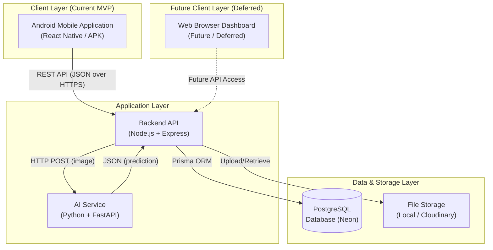
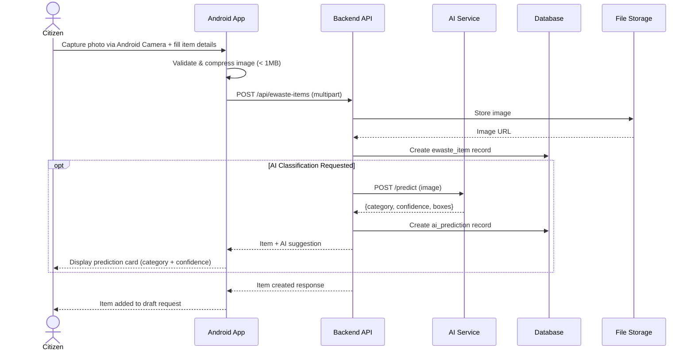
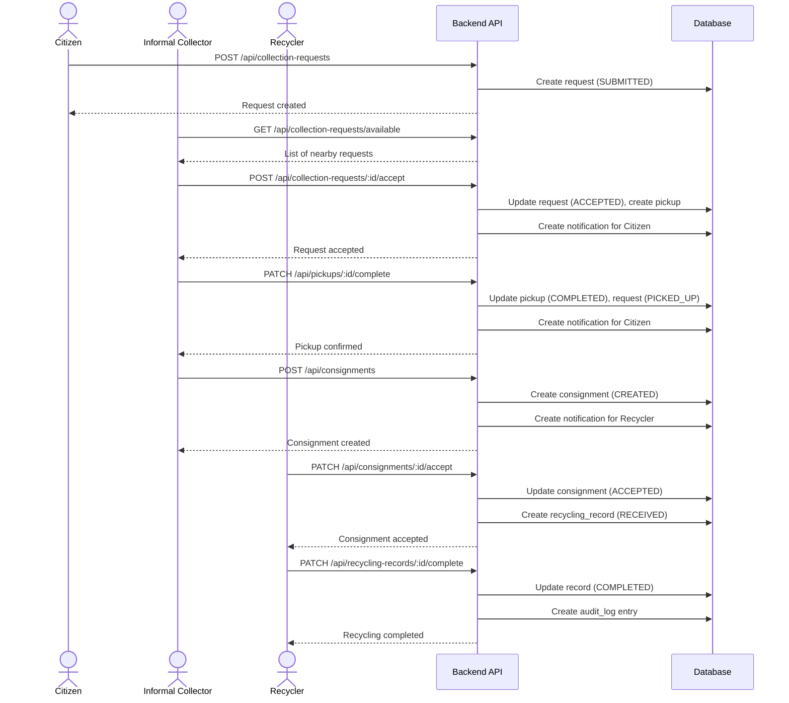
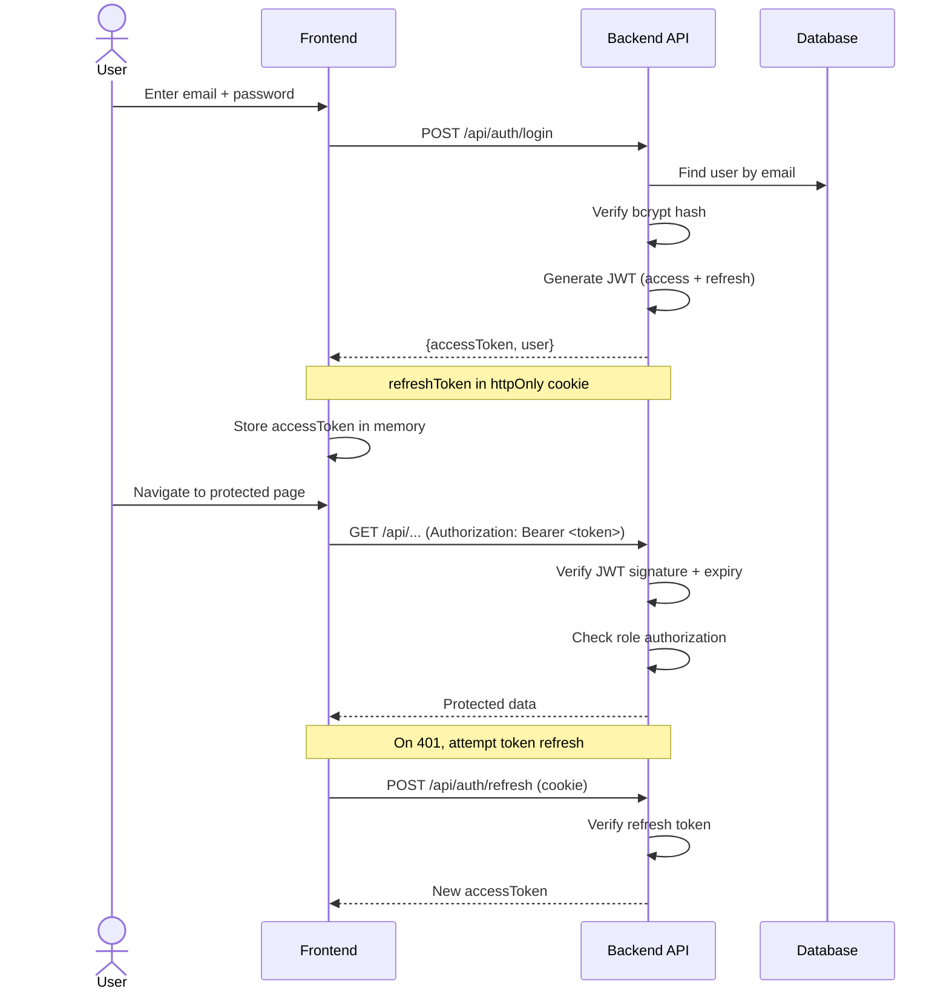
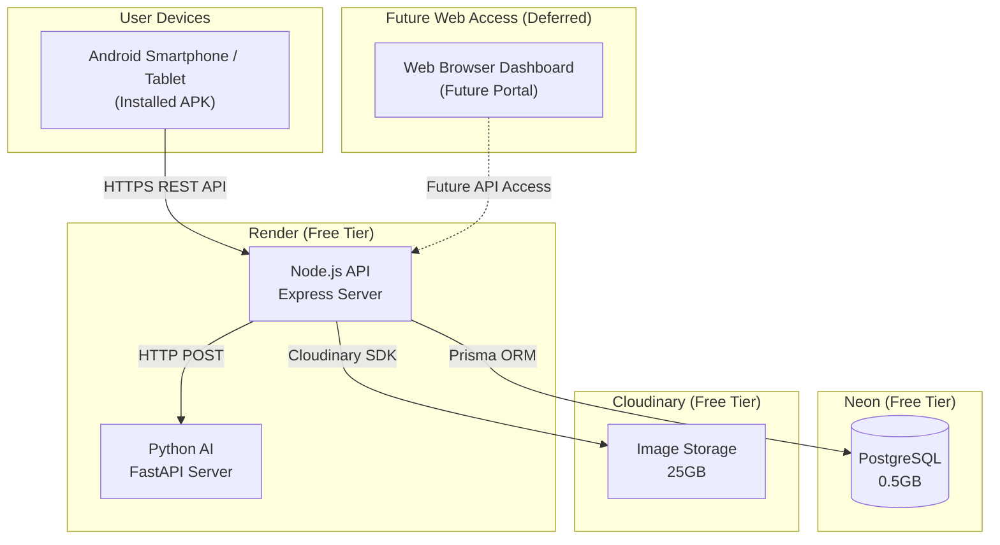

# EcoSetu — System Architecture

> **Reference:** All terminology follows `00_PROJECT_INDEX.md`.

---

## 1. Architecture Overview

EcoSetu follows a client-server architecture with an **Android-first client layer**, a client-independent backend, and a dedicated AI microservice:

```text
                    ECOSETU
                       │
                       ▼
              Android Application
                       │
                       ▼
                 Backend APIs
                       │
         ┌─────────────┼─────────────┐
         ▼             ▼             ▼
      Database      Storage          AI
```

1. **Client Layer (Current MVP)** — Android Application built with React Native, communicating with the backend over HTTPS REST APIs. A future web application is marked as **FUTURE / DEFERRED** to consume the exact same backend endpoints.
2. **Backend Layer** — Node.js/Express REST API handling business logic, authentication, and database transactions.
3. **Database Layer** — PostgreSQL for structured relational data and lifecycle tracking.
4. **AI Service Layer** — Python/FastAPI microservice executing fine-tuned YOLOv8 e-waste object classification.
5. **Storage Layer** — Cloudinary / local storage for e-waste inspection photographs.



---

## 2. Component Architecture

### 2.1 Frontend: Android Application (React Native)

| Responsibility | Implementation |
|---------------|---------------|
| UI rendering | React Native 0.73+ with native Android components & StyleSheet |
| Navigation | React Navigation 6 (Native Stack + Bottom Tabs + Drawer) |
| State management | React Context + useReducer / hooks |
| API communication | Fetch API with resilient mobile wrapper (retry + timeout) |
| Authentication | JWT access token stored in `@react-native-async-storage` (Bearer header) |
| Image capture & upload | Android Camera API / Image Picker (`react-native-vision-camera`) + multipart FormData |
| Image compression | Client-side JPEG compression (< 1MB) prior to network upload |
| Maps & Geolocation | `react-native-maps` + native Android Geolocation (`react-native-geolocation-service`) |
| Offline / Network | Local action caching with NetInfo connectivity detection |
| Notifications | Android Notification Channels with local / push notification listeners |
| Build & Packaging | Android Gradle (`./gradlew assembleRelease` generating APK) |

> **Web Application (Future / Deferred):** A desktop browser web portal consuming the identical Node.js backend REST APIs is planned for a future phase to support high-volume institutional bulk submissions and complex admin analytics.

### 2.2 Backend (Node.js + Express)

| Responsibility | Implementation |
|---------------|---------------|
| HTTP server | Express.js |
| Request routing | Express Router (modular by domain) |
| Authentication | JWT verification middleware |
| Authorization | Role-checking middleware |
| Input validation | express-validator |
| Database access | Prisma ORM |
| File handling | multer (upload) → Cloudinary SDK or local disk |
| Error handling | Centralized error middleware |
| Logging | winston logger |
| CORS | cors middleware (configured for frontend origin) |
| Rate limiting | express-rate-limit |

### 2.3 AI Service (Python + FastAPI)

| Responsibility | Implementation |
|---------------|---------------|
| Image inference | YOLOv8 (Ultralytics) |
| API server | FastAPI with uvicorn |
| Image preprocessing | Pillow / OpenCV |
| Model loading | Load on startup, keep in memory |
| Response format | JSON with category, confidence, bounding boxes |

### 2.4 Database (PostgreSQL)

| Responsibility | Implementation |
|---------------|---------------|
| Data storage | PostgreSQL (Neon free tier) |
| Schema management | Prisma Migrate |
| Seeding | Prisma seed scripts |
| Connection | Connection pooling via Prisma |

### 2.5 File Storage

| Environment | Implementation |
|------------|---------------|
| Development | Local filesystem (`./uploads/`) |
| Production/Demo | Cloudinary free tier (25GB storage, 25GB bandwidth/month) |

---

## 3. Data Flow Diagrams

### 3.1 E-Waste Submission Flow



### 3.2 Collection Request to Recycling Flow



---

## 4. Authentication Flow



---

## 5. Security Boundaries

```mermaid
graph TB
    subgraph "Public Zone"
        LOGIN["Login / Register"]
        LANDING["Landing Page"]
    end

    subgraph "Authenticated Zone"
        subgraph "CITIZEN Access"
            C_SUBMIT["Submit E-Waste"]
            C_REQUEST["Create Request"]
            C_TRACK["Track Status"]
        end

        subgraph "INFORMAL_COLLECTOR Access"
            IC_BROWSE["Browse Requests"]
            IC_ACCEPT["Accept Requests"]
            IC_PICKUP["Confirm Pickup"]
            IC_CONSIGN["Create Consignment"]
        end

        subgraph "RECYCLER Access"
            R_RECEIVE["Receive Consignment"]
            R_PROCESS["Record Processing"]
            R_COMPLETE["Complete Recycling"]
        end

        subgraph "ADMIN Access"
            A_VERIFY["Verify Users"]
            A_MONITOR["Monitor Platform"]
            A_MANAGE["Manage Users"]
            A_AUDIT["View Audit Logs"]
        end
    end

    LOGIN --> C_SUBMIT
    LOGIN --> IC_BROWSE
    LOGIN --> R_RECEIVE
    LOGIN --> A_VERIFY
```



Each zone enforces:
- **Authentication** — Valid JWT required
- **Authorization** — Role must match endpoint requirement
- **Verification** — INFORMAL_COLLECTOR and RECYCLER must be in `ACTIVE` status (verified)

---

## 6. External Integrations

| Integration | Type | Purpose | Status |
|------------|------|---------|--------|
| OpenStreetMap | **Real** | Map tiles for location display | Free, no API key |
| react-native-maps | **Real** | Android native map rendering library | Free, open-source |
| Cloudinary | **Real** | Image storage (demo) | Free tier: 25GB |
| Neon | **Real** | PostgreSQL hosting (demo) | Free tier: 0.5GB |
| Android Gradle | **Real** | APK generation (`assembleRelease`) | Local Android SDK / Gradle |
| Render | **Real** | Backend & AI hosting | Free tier |
| Aadhaar | **Mock** | Identity verification | Mocked validation logic |
| EPR Portal | **Mock** | Regulatory compliance reporting | Mocked compliance payloads |
| Web Portal | **Deferred** | Future desktop browser portal | Future phase (shares same APIs) |
| SMS Gateway | **Not Implemented** | User notifications via SMS | Future enhancement |
| Payment Gateway | **Not Implemented** | Transaction processing | Out of scope |

---

## 7. Deployment Architecture



> **Note:** Render free tier services spin down after inactivity. First request after idle may take ~30 seconds. This is acceptable for an SIH demo with pre-warmed services.

---

## 8. Scalability Considerations (Future)

These are NOT implemented in the MVP but documented for presentation:

| Concern | Current (MVP) | Future |
|---------|--------------|--------|
| Backend scaling | Single Render instance | Horizontal scaling with load balancer |
| Database scaling | Single Neon instance | Read replicas, connection pooling |
| AI inference | Single FastAPI instance | GPU-backed inference, batching |
| File storage | Cloudinary free tier | S3/GCS with CDN |
| Caching | None | Redis for session/query caching |
| Message queue | None | Bull/Redis for background jobs |

---

*All terminology in this document follows `00_PROJECT_INDEX.md`.*
