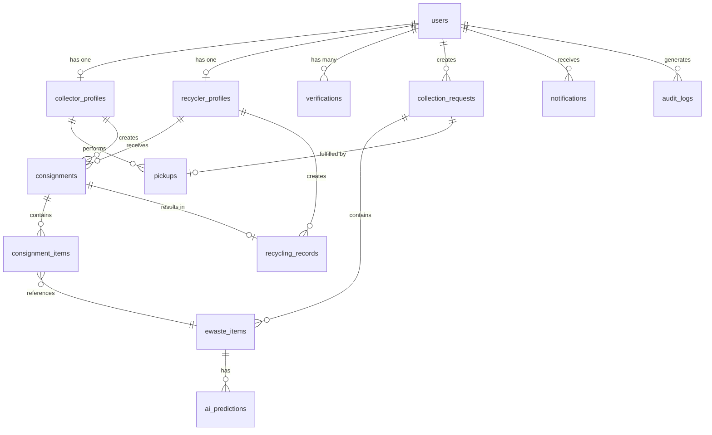

# EcoSetu — Database Schema

> **Reference:** All terminology follows `00_PROJECT_INDEX.md`.

---

## 1. Overview

The database uses **PostgreSQL** accessed via **Prisma ORM**. All primary keys are UUIDs. All tables include `created_at` and `updated_at` timestamps. Soft deletes are used for data that must be preserved for traceability.

---

## 2. ER Diagram



---

## 3. Table Definitions

### 3.1 `users`

**Purpose:** Stores all platform users regardless of role.

| Field | Type | Nullable | Default | Constraints | Description |
|-------|------|:--------:|---------|-------------|-------------|
| `id` | UUID | No | `gen_random_uuid()` | PK | Unique user identifier |
| `email` | VARCHAR(255) | No | — | UNIQUE, NOT NULL | Login email |
| `password_hash` | VARCHAR(255) | No | — | NOT NULL | bcrypt hashed password |
| `name` | VARCHAR(100) | No | — | NOT NULL | Full name |
| `phone` | VARCHAR(15) | Yes | NULL | — | Phone number (optional) |
| `role` | ENUM | No | — | NOT NULL | One of: `CITIZEN`, `INFORMAL_COLLECTOR`, `RECYCLER`, `ADMIN` |
| `status` | ENUM | No | `PENDING_VERIFICATION` | NOT NULL | One of: `PENDING_VERIFICATION`, `ACTIVE`, `SUSPENDED`, `DEACTIVATED` |
| `avatar_url` | VARCHAR(500) | Yes | NULL | — | Profile image URL |
| `created_at` | TIMESTAMPTZ | No | `now()` | NOT NULL | Account creation time |
| `updated_at` | TIMESTAMPTZ | No | `now()` | NOT NULL | Last update time |

**Indexes:**
- `idx_users_email` — UNIQUE on `email`
- `idx_users_role` — on `role`
- `idx_users_status` — on `status`

**Notes:**
- CITIZEN accounts are set to `ACTIVE` immediately upon registration (no verification needed).
- INFORMAL_COLLECTOR and RECYCLER accounts start as `PENDING_VERIFICATION`.
- ADMIN accounts are seeded; not created through registration.
- `phone` is optional; collected only if the user provides it. Used for contact during pickup coordination.

---

### 3.2 `collector_profiles`

**Purpose:** Extended profile for users with role `INFORMAL_COLLECTOR`.

| Field | Type | Nullable | Default | Constraints | Description |
|-------|------|:--------:|---------|-------------|-------------|
| `id` | UUID | No | `gen_random_uuid()` | PK | Profile identifier |
| `user_id` | UUID | No | — | FK → `users.id`, UNIQUE | Associated user |
| `service_area_lat` | DECIMAL(10,7) | Yes | NULL | — | Center latitude of service area |
| `service_area_lng` | DECIMAL(10,7) | Yes | NULL | — | Center longitude of service area |
| `service_radius_km` | DECIMAL(5,2) | Yes | 5.00 | — | Service radius in kilometers |
| `id_document_url` | VARCHAR(500) | Yes | NULL | — | Uploaded ID document (for verification) |
| `bio` | TEXT | Yes | NULL | — | Short description of experience |
| `is_available` | BOOLEAN | No | `true` | NOT NULL | Whether currently accepting requests |
| `total_pickups` | INTEGER | No | 0 | NOT NULL, >= 0 | Counter for completed pickups |
| `created_at` | TIMESTAMPTZ | No | `now()` | NOT NULL | |
| `updated_at` | TIMESTAMPTZ | No | `now()` | NOT NULL | |

**Indexes:**
- `idx_cp_user_id` — UNIQUE on `user_id`
- `idx_cp_available` — on `is_available`
- `idx_cp_location` — on (`service_area_lat`, `service_area_lng`)

**Data Privacy:**
- `id_document_url` — Required for verification; accessible only by ADMIN; retained while account is active; deleted on account deactivation.
- `service_area_lat/lng` — Approximate area only (not real-time tracking); accessible to system for request matching.

---

### 3.3 `recycler_profiles`

**Purpose:** Extended profile for users with role `RECYCLER`.

| Field | Type | Nullable | Default | Constraints | Description |
|-------|------|:--------:|---------|-------------|-------------|
| `id` | UUID | No | `gen_random_uuid()` | PK | Profile identifier |
| `user_id` | UUID | No | — | FK → `users.id`, UNIQUE | Associated user |
| `facility_name` | VARCHAR(200) | No | — | NOT NULL | Name of recycling facility |
| `facility_address` | TEXT | No | — | NOT NULL | Physical address |
| `facility_lat` | DECIMAL(10,7) | Yes | NULL | — | Facility latitude |
| `facility_lng` | DECIMAL(10,7) | Yes | NULL | — | Facility longitude |
| `license_number` | VARCHAR(100) | Yes | NULL | — | Recycling license number (if available) |
| `license_document_url` | VARCHAR(500) | Yes | NULL | — | Uploaded license document |
| `accepted_categories` | TEXT[] | No | `{}` | NOT NULL | Array of accepted e-waste category IDs |
| `total_consignments` | INTEGER | No | 0 | NOT NULL, >= 0 | Counter for received consignments |
| `created_at` | TIMESTAMPTZ | No | `now()` | NOT NULL | |
| `updated_at` | TIMESTAMPTZ | No | `now()` | NOT NULL | |

**Indexes:**
- `idx_rp_user_id` — UNIQUE on `user_id`
- `idx_rp_location` — on (`facility_lat`, `facility_lng`)

**Data Privacy:**
- `license_document_url` — Required for verification; accessible only by ADMIN; retained while account is active.

---

### 3.4 `ewaste_items`

**Purpose:** Individual e-waste items submitted by citizens.

| Field | Type | Nullable | Default | Constraints | Description |
|-------|------|:--------:|---------|-------------|-------------|
| `id` | UUID | No | `gen_random_uuid()` | PK | Item identifier |
| `collection_request_id` | UUID | Yes | NULL | FK → `collection_requests.id` | Associated request (null if draft) |
| `citizen_id` | UUID | No | — | FK → `users.id` | Submitting citizen |
| `category` | ENUM | No | — | NOT NULL | Canonical e-waste category |
| `description` | TEXT | Yes | NULL | — | User description of the item |
| `quantity` | INTEGER | No | 1 | NOT NULL, >= 1 | Number of items |
| `condition` | ENUM | No | `UNKNOWN` | NOT NULL | `WORKING`, `NOT_WORKING`, `DAMAGED`, `UNKNOWN` |
| `estimated_weight_kg` | DECIMAL(8,2) | Yes | NULL | — | Citizen's estimate (may be inaccurate) |
| `actual_weight_kg` | DECIMAL(8,2) | Yes | NULL | — | Measured by collector at pickup |
| `image_url` | VARCHAR(500) | Yes | NULL | — | Photo of the item |
| `status` | ENUM | No | `SUBMITTED` | NOT NULL | `SUBMITTED`, `COLLECTED`, `CONSIGNED`, `RECYCLED` |
| `created_at` | TIMESTAMPTZ | No | `now()` | NOT NULL | |
| `updated_at` | TIMESTAMPTZ | No | `now()` | NOT NULL | |

**Indexes:**
- `idx_ei_request` — on `collection_request_id`
- `idx_ei_citizen` — on `citizen_id`
- `idx_ei_category` — on `category`
- `idx_ei_status` — on `status`

---

### 3.5 `collection_requests`

**Purpose:** Citizen request for e-waste pickup.

| Field | Type | Nullable | Default | Constraints | Description |
|-------|------|:--------:|---------|-------------|-------------|
| `id` | UUID | No | `gen_random_uuid()` | PK | Request identifier |
| `citizen_id` | UUID | No | — | FK → `users.id` | Requesting citizen |
| `status` | ENUM | No | `DRAFT` | NOT NULL | See canonical status values |
| `pickup_address` | TEXT | No | — | NOT NULL | Human-readable address |
| `pickup_lat` | DECIMAL(10,7) | No | — | NOT NULL | Latitude |
| `pickup_lng` | DECIMAL(10,7) | No | — | NOT NULL | Longitude |
| `preferred_date` | DATE | Yes | NULL | — | Preferred pickup date |
| `preferred_time_start` | TIME | Yes | NULL | — | Preferred window start |
| `preferred_time_end` | TIME | Yes | NULL | — | Preferred window end |
| `notes` | TEXT | Yes | NULL | — | Additional instructions |
| `collector_id` | UUID | Yes | NULL | FK → `collector_profiles.id` | Assigned collector (after acceptance) |
| `submitted_at` | TIMESTAMPTZ | Yes | NULL | — | When moved from DRAFT to SUBMITTED |
| `accepted_at` | TIMESTAMPTZ | Yes | NULL | — | When collector accepted |
| `completed_at` | TIMESTAMPTZ | Yes | NULL | — | When pickup completed |
| `cancelled_at` | TIMESTAMPTZ | Yes | NULL | — | When cancelled (if applicable) |
| `cancellation_reason` | TEXT | Yes | NULL | — | Reason for cancellation |
| `created_at` | TIMESTAMPTZ | No | `now()` | NOT NULL | |
| `updated_at` | TIMESTAMPTZ | No | `now()` | NOT NULL | |

**Indexes:**
- `idx_cr_citizen` — on `citizen_id`
- `idx_cr_status` — on `status`
- `idx_cr_collector` — on `collector_id`
- `idx_cr_location` — on (`pickup_lat`, `pickup_lng`)

**Data Privacy:**
- `pickup_address`, `pickup_lat`, `pickup_lng` — Required for pickup logistics. Visible only to the assigned collector and admin. Approximate location shown to other collectors during request browsing.

---

### 3.6 `pickups`

**Purpose:** Records the actual collection event.

| Field | Type | Nullable | Default | Constraints | Description |
|-------|------|:--------:|---------|-------------|-------------|
| `id` | UUID | No | `gen_random_uuid()` | PK | Pickup identifier |
| `collection_request_id` | UUID | No | — | FK → `collection_requests.id`, UNIQUE | Associated request |
| `collector_id` | UUID | No | — | FK → `collector_profiles.id` | Performing collector |
| `status` | ENUM | No | `SCHEDULED` | NOT NULL | See canonical status values |
| `scheduled_date` | DATE | Yes | NULL | — | Planned pickup date |
| `started_at` | TIMESTAMPTZ | Yes | NULL | — | When pickup began |
| `completed_at` | TIMESTAMPTZ | Yes | NULL | — | When pickup finished |
| `total_weight_kg` | DECIMAL(8,2) | Yes | NULL | — | Total weight collected |
| `pickup_photo_url` | VARCHAR(500) | Yes | NULL | — | Photo confirmation |
| `collector_notes` | TEXT | Yes | NULL | — | Collector's notes |
| `created_at` | TIMESTAMPTZ | No | `now()` | NOT NULL | |
| `updated_at` | TIMESTAMPTZ | No | `now()` | NOT NULL | |

**Indexes:**
- `idx_p_request` — UNIQUE on `collection_request_id`
- `idx_p_collector` — on `collector_id`
- `idx_p_status` — on `status`

---

### 3.7 `consignments`

**Purpose:** Batch of items delivered by a collector to a recycler.

| Field | Type | Nullable | Default | Constraints | Description |
|-------|------|:--------:|---------|-------------|-------------|
| `id` | UUID | No | `gen_random_uuid()` | PK | Consignment identifier |
| `collector_id` | UUID | No | — | FK → `collector_profiles.id` | Delivering collector |
| `recycler_id` | UUID | No | — | FK → `recycler_profiles.id` | Receiving recycler |
| `status` | ENUM | No | `CREATED` | NOT NULL | See canonical status values |
| `total_weight_kg` | DECIMAL(8,2) | Yes | NULL | — | Total weight of consignment |
| `total_items` | INTEGER | No | 0 | NOT NULL, >= 0 | Number of items |
| `delivery_notes` | TEXT | Yes | NULL | — | Delivery notes |
| `delivered_at` | TIMESTAMPTZ | Yes | NULL | — | When delivered |
| `accepted_at` | TIMESTAMPTZ | Yes | NULL | — | When recycler accepted |
| `rejected_at` | TIMESTAMPTZ | Yes | NULL | — | When recycler rejected |
| `rejection_reason` | TEXT | Yes | NULL | — | Reason for rejection |
| `created_at` | TIMESTAMPTZ | No | `now()` | NOT NULL | |
| `updated_at` | TIMESTAMPTZ | No | `now()` | NOT NULL | |

**Indexes:**
- `idx_con_collector` — on `collector_id`
- `idx_con_recycler` — on `recycler_id`
- `idx_con_status` — on `status`

---

### 3.8 `consignment_items`

**Purpose:** Junction table linking e-waste items to consignments.

| Field | Type | Nullable | Default | Constraints | Description |
|-------|------|:--------:|---------|-------------|-------------|
| `id` | UUID | No | `gen_random_uuid()` | PK | Record identifier |
| `consignment_id` | UUID | No | — | FK → `consignments.id` | Parent consignment |
| `ewaste_item_id` | UUID | No | — | FK → `ewaste_items.id` | E-waste item |
| `created_at` | TIMESTAMPTZ | No | `now()` | NOT NULL | |

**Indexes:**
- `idx_ci_consignment` — on `consignment_id`
- `idx_ci_item` — on `ewaste_item_id`
- UNIQUE constraint on (`consignment_id`, `ewaste_item_id`)

---

### 3.9 `recycling_records`

**Purpose:** Records recycling processing and completion.

| Field | Type | Nullable | Default | Constraints | Description |
|-------|------|:--------:|---------|-------------|-------------|
| `id` | UUID | No | `gen_random_uuid()` | PK | Record identifier |
| `consignment_id` | UUID | No | — | FK → `consignments.id`, UNIQUE | Associated consignment |
| `recycler_id` | UUID | No | — | FK → `recycler_profiles.id` | Processing recycler |
| `status` | ENUM | No | `RECEIVED` | NOT NULL | `RECEIVED`, `PROCESSING`, `COMPLETED` |
| `processing_notes` | TEXT | Yes | NULL | — | Details of processing |
| `output_description` | TEXT | Yes | NULL | — | Description of recycled output |
| `output_weight_kg` | DECIMAL(8,2) | Yes | NULL | — | Weight of recycled material |
| `completion_certificate_url` | VARCHAR(500) | Yes | NULL | — | Certificate of recycling (if available) |
| `received_at` | TIMESTAMPTZ | No | `now()` | NOT NULL | When materials received |
| `processing_started_at` | TIMESTAMPTZ | Yes | NULL | — | When processing began |
| `completed_at` | TIMESTAMPTZ | Yes | NULL | — | When recycling completed |
| `created_at` | TIMESTAMPTZ | No | `now()` | NOT NULL | |
| `updated_at` | TIMESTAMPTZ | No | `now()` | NOT NULL | |

**Indexes:**
- `idx_rr_consignment` — UNIQUE on `consignment_id`
- `idx_rr_recycler` — on `recycler_id`
- `idx_rr_status` — on `status`

---

### 3.10 `ai_predictions`

**Purpose:** Stores AI model inference results for e-waste images.

| Field | Type | Nullable | Default | Constraints | Description |
|-------|------|:--------:|---------|-------------|-------------|
| `id` | UUID | No | `gen_random_uuid()` | PK | Prediction identifier |
| `ewaste_item_id` | UUID | No | — | FK → `ewaste_items.id` | Associated item |
| `image_url` | VARCHAR(500) | No | — | NOT NULL | Image used for prediction |
| `predicted_category` | ENUM | No | — | NOT NULL | Model's predicted category |
| `confidence` | DECIMAL(5,4) | No | — | NOT NULL, 0-1 | Confidence score (0.0000-1.0000) |
| `all_predictions` | JSONB | Yes | NULL | — | Full prediction array (all classes with scores) |
| `model_version` | VARCHAR(50) | No | — | NOT NULL | Model version identifier |
| `was_accepted` | BOOLEAN | Yes | NULL | — | Whether user accepted the prediction |
| `user_corrected_category` | ENUM | Yes | NULL | — | Category selected by user (if different) |
| `inference_time_ms` | INTEGER | Yes | NULL | — | Inference time in milliseconds |
| `created_at` | TIMESTAMPTZ | No | `now()` | NOT NULL | |

**Indexes:**
- `idx_ap_item` — on `ewaste_item_id`
- `idx_ap_accepted` — on `was_accepted`

**Notes:**
- `was_accepted` = NULL means user hasn't responded yet
- `was_accepted` = false + `user_corrected_category` = valuable training signal
- `all_predictions` stores the full softmax output for analysis

---

### 3.11 `verifications`

**Purpose:** Tracks verification requests for collectors and recyclers.

| Field | Type | Nullable | Default | Constraints | Description |
|-------|------|:--------:|---------|-------------|-------------|
| `id` | UUID | No | `gen_random_uuid()` | PK | Verification identifier |
| `user_id` | UUID | No | — | FK → `users.id` | User being verified |
| `status` | ENUM | No | `PENDING` | NOT NULL | `PENDING`, `APPROVED`, `REJECTED` |
| `document_url` | VARCHAR(500) | Yes | NULL | — | Uploaded verification document |
| `submitted_at` | TIMESTAMPTZ | No | `now()` | NOT NULL | When submitted |
| `reviewed_at` | TIMESTAMPTZ | Yes | NULL | — | When admin reviewed |
| `reviewed_by` | UUID | Yes | NULL | FK → `users.id` | Admin who reviewed |
| `review_notes` | TEXT | Yes | NULL | — | Admin's review comments |
| `created_at` | TIMESTAMPTZ | No | `now()` | NOT NULL | |
| `updated_at` | TIMESTAMPTZ | No | `now()` | NOT NULL | |

**Indexes:**
- `idx_v_user` — on `user_id`
- `idx_v_status` — on `status`

**Data Privacy:**
- `document_url` — Contains identity documents. Accessible only by ADMIN. Must be deleted when no longer needed for verification.

---

### 3.12 `notifications`

**Purpose:** In-app notifications for users.

| Field | Type | Nullable | Default | Constraints | Description |
|-------|------|:--------:|---------|-------------|-------------|
| `id` | UUID | No | `gen_random_uuid()` | PK | Notification identifier |
| `user_id` | UUID | No | — | FK → `users.id` | Recipient |
| `type` | VARCHAR(50) | No | — | NOT NULL | Notification type (see 23_NOTIFICATION_SYSTEM.md) |
| `title` | VARCHAR(200) | No | — | NOT NULL | Notification title |
| `message` | TEXT | No | — | NOT NULL | Notification body |
| `is_read` | BOOLEAN | No | `false` | NOT NULL | Read status |
| `reference_type` | VARCHAR(50) | Yes | NULL | — | Type of referenced entity |
| `reference_id` | UUID | Yes | NULL | — | ID of referenced entity |
| `created_at` | TIMESTAMPTZ | No | `now()` | NOT NULL | |

**Indexes:**
- `idx_n_user` — on `user_id`
- `idx_n_read` — on (`user_id`, `is_read`)
- `idx_n_created` — on `created_at` (for ordering)

---

### 3.13 `audit_logs`

**Purpose:** Immutable record of significant platform events.

| Field | Type | Nullable | Default | Constraints | Description |
|-------|------|:--------:|---------|-------------|-------------|
| `id` | UUID | No | `gen_random_uuid()` | PK | Log entry identifier |
| `actor_id` | UUID | Yes | NULL | FK → `users.id` | User who performed the action (NULL for system) |
| `action` | VARCHAR(100) | No | — | NOT NULL | Action performed (e.g., `REQUEST_CREATED`, `PICKUP_COMPLETED`) |
| `entity_type` | VARCHAR(50) | No | — | NOT NULL | Type of entity affected |
| `entity_id` | UUID | No | — | NOT NULL | ID of entity affected |
| `details` | JSONB | Yes | NULL | — | Additional context |
| `ip_address` | VARCHAR(45) | Yes | NULL | — | Request IP (for security auditing) |
| `created_at` | TIMESTAMPTZ | No | `now()` | NOT NULL | Immutable timestamp |

**Indexes:**
- `idx_al_actor` — on `actor_id`
- `idx_al_action` — on `action`
- `idx_al_entity` — on (`entity_type`, `entity_id`)
- `idx_al_created` — on `created_at`

**Notes:**
- Audit logs are **append-only**. No UPDATE or DELETE operations on this table.
- No `updated_at` field — records are immutable.

---

### 3.14 `device_tokens`

**Purpose:** Associates Android FCM registration tokens with authenticated users for push delivery (docs/23_NOTIFICATION_SYSTEM.md Section 4.5).

| Field | Type | Nullable | Default | Constraints | Description |
|-------|------|:--------:|---------|-------------|-------------|
| `id` | UUID | No | `gen_random_uuid()` | PK | Token record identifier |
| `user_id` | UUID | No | — | FK → `users.id` | Authenticated token owner |
| `token` | VARCHAR(500) | No | — | UNIQUE, NOT NULL | FCM registration token |
| `platform` | VARCHAR(20) | No | `'android'` | NOT NULL | Device platform (`android`) |
| `is_active` | BOOLEAN | No | `true` | NOT NULL | Active status for push delivery |
| `created_at` | TIMESTAMPTZ | No | `now()` | NOT NULL | When registered |
| `updated_at` | TIMESTAMPTZ | No | `now()` | NOT NULL | When refreshed |

**Indexes:**
- `idx_dt_user` — on `user_id`
- `idx_dt_active` — on (`user_id`, `is_active`)
- Unique constraint on `token`

**Security & Lifecycle:**
- Multiple devices per user are supported.
- Tokens belong strictly to the authenticated `user_id`.
- Tokens are masked in application logs and never exposed in public responses.
- Inactive or stale tokens are invalidated upon user logout or when FCM reports unregistered token errors.

---

## 4. Enum Definitions

```
-- User Roles
ENUM user_role: CITIZEN, INFORMAL_COLLECTOR, RECYCLER, ADMIN

-- User Status
ENUM user_status: PENDING_VERIFICATION, ACTIVE, SUSPENDED, DEACTIVATED

-- E-Waste Category
ENUM ewaste_category: MOBILE_PHONE, LAPTOP, DESKTOP, TABLET, MONITOR, PRINTER,
                       KEYBOARD_MOUSE, CABLE_CHARGER, BATTERY, CIRCUIT_BOARD, OTHER

-- Item Condition
ENUM item_condition: WORKING, NOT_WORKING, DAMAGED, UNKNOWN

-- Item Status
ENUM item_status: SUBMITTED, COLLECTED, CONSIGNED, RECYCLED

-- Collection Request Status
ENUM request_status: DRAFT, SUBMITTED, ACCEPTED, PICKUP_SCHEDULED, PICKED_UP,
                      CANCELLED, EXPIRED

-- Pickup Status
ENUM pickup_status: SCHEDULED, IN_PROGRESS, COMPLETED, FAILED, CANCELLED

-- Consignment Status
ENUM consignment_status: CREATED, IN_TRANSIT, DELIVERED, ACCEPTED, REJECTED

-- Recycling Record Status
ENUM recycling_status: RECEIVED, PROCESSING, COMPLETED

-- Verification Status
ENUM verification_status: PENDING, APPROVED, REJECTED
```

---

## 5. Relationships Summary

| Parent | Child | Type | FK Field |
|--------|-------|------|----------|
| `users` | `collector_profiles` | One-to-One | `collector_profiles.user_id` |
| `users` | `recycler_profiles` | One-to-One | `recycler_profiles.user_id` |
| `users` | `collection_requests` | One-to-Many | `collection_requests.citizen_id` |
| `users` | `verifications` | One-to-Many | `verifications.user_id` |
| `users` | `notifications` | One-to-Many | `notifications.user_id` |
| `users` | `audit_logs` | One-to-Many | `audit_logs.actor_id` |
| `collection_requests` | `ewaste_items` | One-to-Many | `ewaste_items.collection_request_id` |
| `collection_requests` | `pickups` | One-to-One | `pickups.collection_request_id` |
| `collector_profiles` | `pickups` | One-to-Many | `pickups.collector_id` |
| `collector_profiles` | `consignments` | One-to-Many | `consignments.collector_id` |
| `recycler_profiles` | `consignments` | One-to-Many | `consignments.recycler_id` |
| `consignments` | `consignment_items` | One-to-Many | `consignment_items.consignment_id` |
| `ewaste_items` | `consignment_items` | One-to-Many | `consignment_items.ewaste_item_id` |
| `consignments` | `recycling_records` | One-to-One | `recycling_records.consignment_id` |
| `recycler_profiles` | `recycling_records` | One-to-Many | `recycling_records.recycler_id` |
| `ewaste_items` | `ai_predictions` | One-to-Many | `ai_predictions.ewaste_item_id` |
| `collection_requests` | `collector_profiles` | Many-to-One | `collection_requests.collector_id` |

---

## 6. Seed Data Requirements

For development and SIH demonstration:

| Table | Seed Data |
|-------|-----------|
| `users` | 1 ADMIN, 2 CITIZENs, 2 INFORMAL_COLLECTORs (verified), 1 RECYCLER (verified) |
| `collector_profiles` | 2 profiles with different service areas |
| `recycler_profiles` | 1 profile accepting all categories |
| `ewaste_items` | 5-10 sample items across categories |
| `collection_requests` | 3 requests in various statuses |
| `pickups` | 1 completed pickup |
| `consignments` | 1 delivered consignment |
| `recycling_records` | 1 completed record |

---

*All terminology in this document follows `00_PROJECT_INDEX.md`.*
