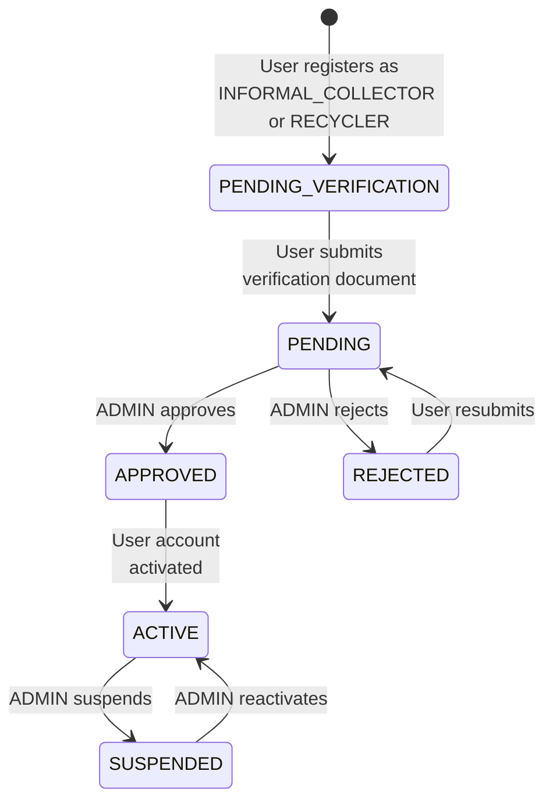

# EcoSetu — Roles and Permissions

> **Reference:** All terminology follows `00_PROJECT_INDEX.md`.

---

## 1. Role Definitions

### 1.1 CITIZEN

| Attribute | Value |
|-----------|-------|
| **Description** | A person or household generating e-waste for disposal |
| **Registration** | Self-registration via `/api/v1/auth/register` |
| **Verification Required** | No — account is `ACTIVE` immediately |
| **Primary Actions** | Submit e-waste items, create collection requests, track status, view traceability |

### 1.2 INFORMAL_COLLECTOR

| Attribute | Value |
|-----------|-------|
| **Description** | An informal e-waste collector (kabadiwala) who picks up items from citizens |
| **Registration** | Self-registration with role `INFORMAL_COLLECTOR` |
| **Verification Required** | Yes — must submit verification documents; ADMIN must approve |
| **Primary Actions** | Browse available requests, accept requests, perform pickups, create consignments |
| **Pre-verification restrictions** | Can view profile only; cannot browse or accept requests |

### 1.3 RECYCLER

| Attribute | Value |
|-----------|-------|
| **Description** | An authorized e-waste recycling facility |
| **Registration** | Self-registration with role `RECYCLER` |
| **Verification Required** | Yes — must submit facility/license documents; ADMIN must approve |
| **Primary Actions** | Receive consignments, accept/reject deliveries, record recycling processing |
| **Pre-verification restrictions** | Can view profile only; cannot receive consignments |

### 1.4 ADMIN

| Attribute | Value |
|-----------|-------|
| **Description** | Platform administrator with full oversight |
| **Registration** | Seeded in database only; cannot self-register |
| **Verification Required** | N/A |
| **Primary Actions** | Verify users, manage accounts, view analytics, audit logs |

---

## 2. Permission Matrix

✅ = Allowed | ❌ = Denied | 🔒 = Allowed only for own resources | ⚠️ = Requires verification

| Resource / Action | CITIZEN | INFORMAL_COLLECTOR | RECYCLER | ADMIN |
|------------------|:-------:|:------------------:|:--------:|:-----:|
| **Authentication** | | | | |
| Register | ✅ | ✅ | ✅ | ❌ |
| Login | ✅ | ✅ | ✅ | ✅ |
| Refresh token | ✅ | ✅ | ✅ | ✅ |
| **User Profile** | | | | |
| View own profile | ✅ | ✅ | ✅ | ✅ |
| Update own profile | ✅ | ✅ | ✅ | ✅ |
| Upload avatar | ✅ | ✅ | ✅ | ✅ |
| View other user's profile | ❌ | ❌ | ❌ | ✅ |
| **Collector Profile** | | | | |
| Create/update collector profile | ❌ | ✅ | ❌ | ❌ |
| Toggle availability | ❌ | ⚠️ | ❌ | ❌ |
| View collector stats | ❌ | 🔒 | ❌ | ✅ |
| **Recycler Profile** | | | | |
| Create/update recycler profile | ❌ | ❌ | ✅ | ❌ |
| List verified recyclers | ❌ | ⚠️ | ❌ | ✅ |
| **E-Waste Items** | | | | |
| Create item | ✅ | ❌ | ❌ | ❌ |
| View own items | ✅ | ❌ | ❌ | ✅ |
| View assigned items | ❌ | ⚠️ | 🔒 | ✅ |
| View item traceability | 🔒 | ❌ | ❌ | ✅ |
| **Collection Requests** | | | | |
| Create request | ✅ | ❌ | ❌ | ❌ |
| View own requests | ✅ | ❌ | ❌ | ✅ |
| Submit request | 🔒 | ❌ | ❌ | ❌ |
| Browse available requests | ❌ | ⚠️ | ❌ | ❌ |
| Accept request | ❌ | ⚠️ | ❌ | ❌ |
| Cancel request | 🔒 | ❌ | ❌ | ✅ |
| **Pickups** | | | | |
| View assigned pickups | ❌ | 🔒 | ❌ | ✅ |
| Start pickup | ❌ | 🔒 | ❌ | ❌ |
| Complete pickup | ❌ | 🔒 | ❌ | ❌ |
| **Consignments** | | | | |
| Create consignment | ❌ | ⚠️ | ❌ | ❌ |
| View own consignments | ❌ | 🔒 | 🔒 | ✅ |
| Deliver consignment | ❌ | 🔒 | ❌ | ❌ |
| Accept consignment | ❌ | ❌ | 🔒 | ❌ |
| Reject consignment | ❌ | ❌ | 🔒 | ❌ |
| **Recycling Records** | | | | |
| View own records | ❌ | ❌ | 🔒 | ✅ |
| Start processing | ❌ | ❌ | 🔒 | ❌ |
| Complete recycling | ❌ | ❌ | 🔒 | ❌ |
| **AI** | | | | |
| Request prediction | ✅ | ❌ | ❌ | ❌ |
| Submit AI feedback | ✅ | ❌ | ❌ | ❌ |
| **Verification** | | | | |
| Submit verification | ❌ | ✅ | ✅ | ❌ |
| View own verification | ❌ | ✅ | ✅ | ❌ |
| Review verifications | ❌ | ❌ | ❌ | ✅ |
| Approve/reject verification | ❌ | ❌ | ❌ | ✅ |
| **Notifications** | | | | |
| View own notifications | ✅ | ✅ | ✅ | ✅ |
| Mark notifications read | ✅ | ✅ | ✅ | ✅ |
| **Administration** | | | | |
| List all users | ❌ | ❌ | ❌ | ✅ |
| Suspend/reactivate user | ❌ | ❌ | ❌ | ✅ |
| View platform analytics | ❌ | ❌ | ❌ | ✅ |
| View audit logs | ❌ | ❌ | ❌ | ✅ |

---

## 3. Verification Requirements

### 3.1 Verification Flow



### 3.2 What Verification Checks

| Role | Document Required | What Admin Verifies |
|------|------------------|-------------------|
| `INFORMAL_COLLECTOR` | Government-issued ID photo | Identity matches profile name; document is readable; photo is of an actual ID |
| `RECYCLER` | Facility license or business registration | Facility name matches; license is readable; appears legitimate |

> **PROTOTYPE NOTE:** For the SIH demo, verification is a manual review by the admin user. There is no automated document verification (no OCR, no Aadhaar API, no DigiLocker). The admin simply views the uploaded document and clicks Approve or Reject.

### 3.3 Restricted Actions Before Verification

Users with status `PENDING_VERIFICATION` CAN:
- View and update their own profile
- Submit verification documents
- View their verification status
- View notifications

Users with status `PENDING_VERIFICATION` CANNOT:
- Browse or accept collection requests (INFORMAL_COLLECTOR)
- Receive consignments (RECYCLER)
- Perform any operational actions

---

## 4. Role Transitions

| From | To | Trigger | Who |
|------|-----|---------|-----|
| — | `CITIZEN` | Self-registration | User |
| — | `INFORMAL_COLLECTOR` | Self-registration | User |
| — | `RECYCLER` | Self-registration | User |
| `PENDING_VERIFICATION` → `ACTIVE` | Account activation | ADMIN approves verification | ADMIN |
| `ACTIVE` → `SUSPENDED` | Account suspension | ADMIN suspends | ADMIN |
| `SUSPENDED` → `ACTIVE` | Account reactivation | ADMIN reactivates | ADMIN |
| `ACTIVE` → `DEACTIVATED` | Account deactivation | ADMIN deactivates or user requests | ADMIN |

**Notes:**
- Users CANNOT change their own role after registration
- Only ADMIN can transition account statuses
- Role upgrades (e.g., CITIZEN becoming a COLLECTOR) require a new account
- ADMIN accounts cannot be suspended by other ADMINs (self-protection)

---

## 5. Data Visibility Rules

### 5.1 Collection Request Data

| Field | CITIZEN (own) | INFORMAL_COLLECTOR (browsing) | INFORMAL_COLLECTOR (accepted) | ADMIN |
|-------|:---:|:---:|:---:|:---:|
| Request ID | ✅ | ✅ | ✅ | ✅ |
| Item list | ✅ | ✅ (summary) | ✅ (full) | ✅ |
| Pickup address | ✅ | ❌ (area only) | ✅ | ✅ |
| Exact coordinates | ✅ | ❌ | ✅ | ✅ |
| Citizen name | ✅ | ❌ | ✅ | ✅ |
| Citizen phone | ✅ | ❌ | ✅ | ✅ |
| Preferred time | ✅ | ✅ | ✅ | ✅ |

> **Privacy rationale:** Exact address and citizen contact info are only revealed to the collector who has accepted the request. Browsing collectors see only the general area and item categories.

### 5.2 Collector Data

| Field | CITIZEN (assigned collector) | RECYCLER | ADMIN |
|-------|:---:|:---:|:---:|
| Collector name | ✅ | ✅ | ✅ |
| Collector phone | ✅ | ✅ | ✅ |
| Service area | ❌ | ❌ | ✅ |
| ID document | ❌ | ❌ | ✅ |
| Total pickups | ❌ | ❌ | ✅ |

---

## 6. Authorization Enforcement

### 6.1 Server-Side Requirements

Authorization MUST be enforced server-side. Frontend checks are for UX only.

```
Every protected API endpoint MUST:
1. Verify JWT token (authentication middleware)
2. Check user role against endpoint's allowed roles (authorization middleware)
3. Verify resource ownership where applicable (resource middleware)
4. Check user account status is ACTIVE (status middleware)
5. Check verification status for operational endpoints (verification middleware)
```

### 6.2 Middleware Chain

```
Request → rateLimiter → authenticate → authorize(roles) → checkStatus → [checkVerified] → controller
```

| Middleware | Purpose | Applies To |
|-----------|---------|-----------|
| `rateLimiter` | Prevent abuse | All endpoints |
| `authenticate` | Verify JWT, attach user to request | Protected endpoints |
| `authorize(roles)` | Check user role against allowed list | Protected endpoints |
| `checkStatus` | Reject suspended/deactivated users | Protected endpoints |
| `checkVerified` | Reject unverified collectors/recyclers | Operational endpoints |

---

*All terminology in this document follows `00_PROJECT_INDEX.md`.*
