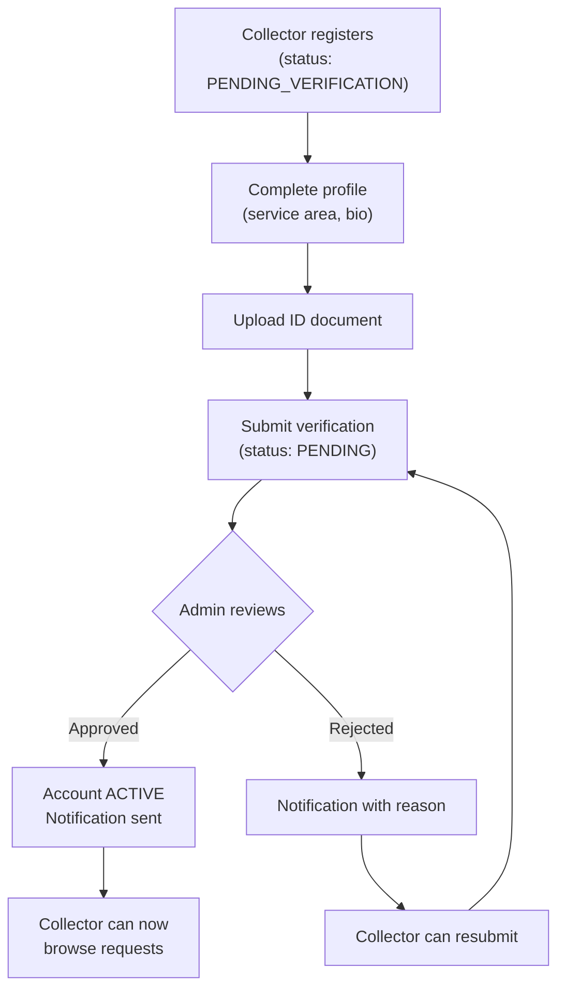
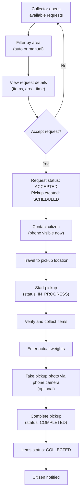
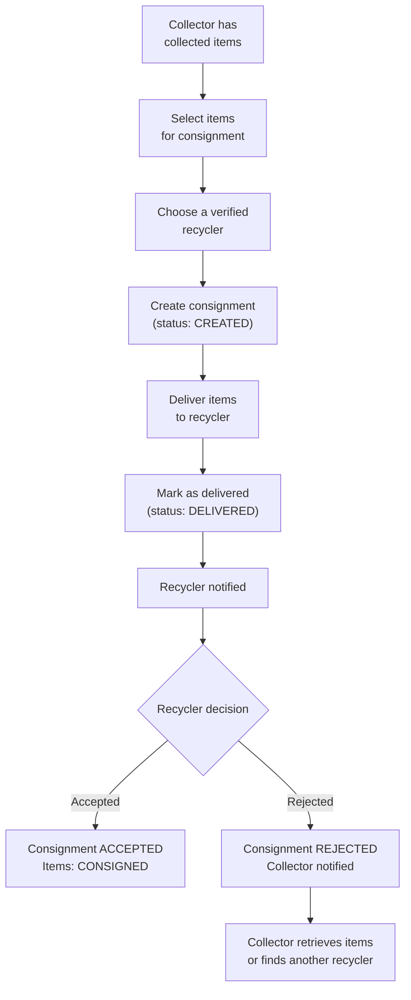
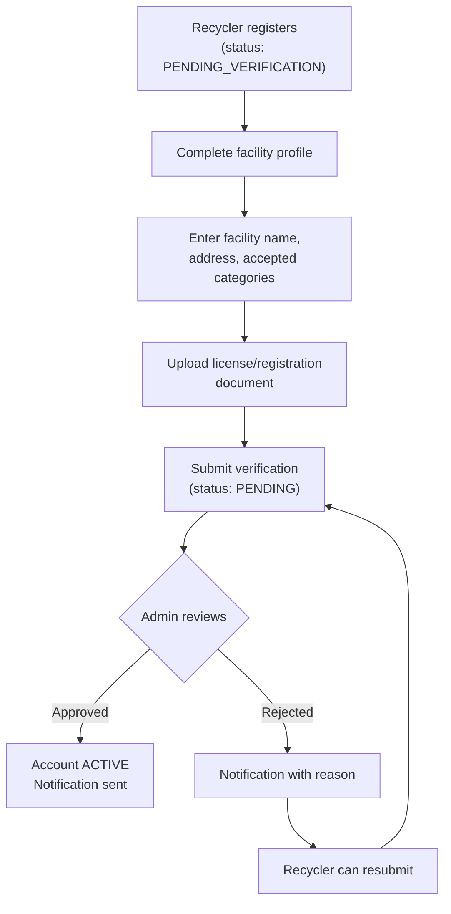
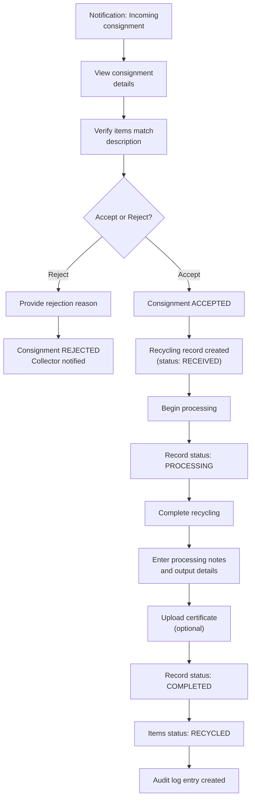
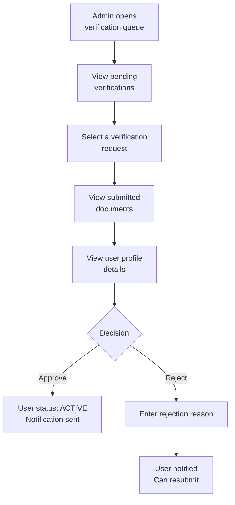
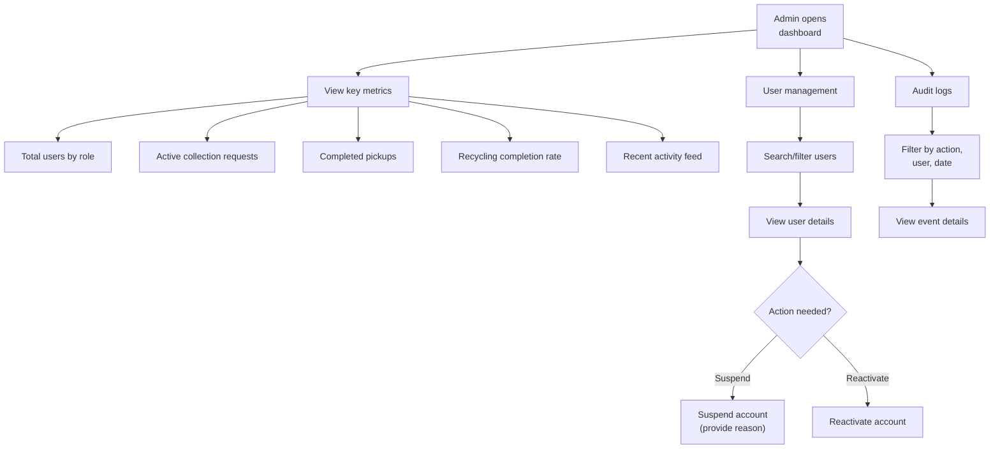
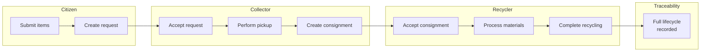
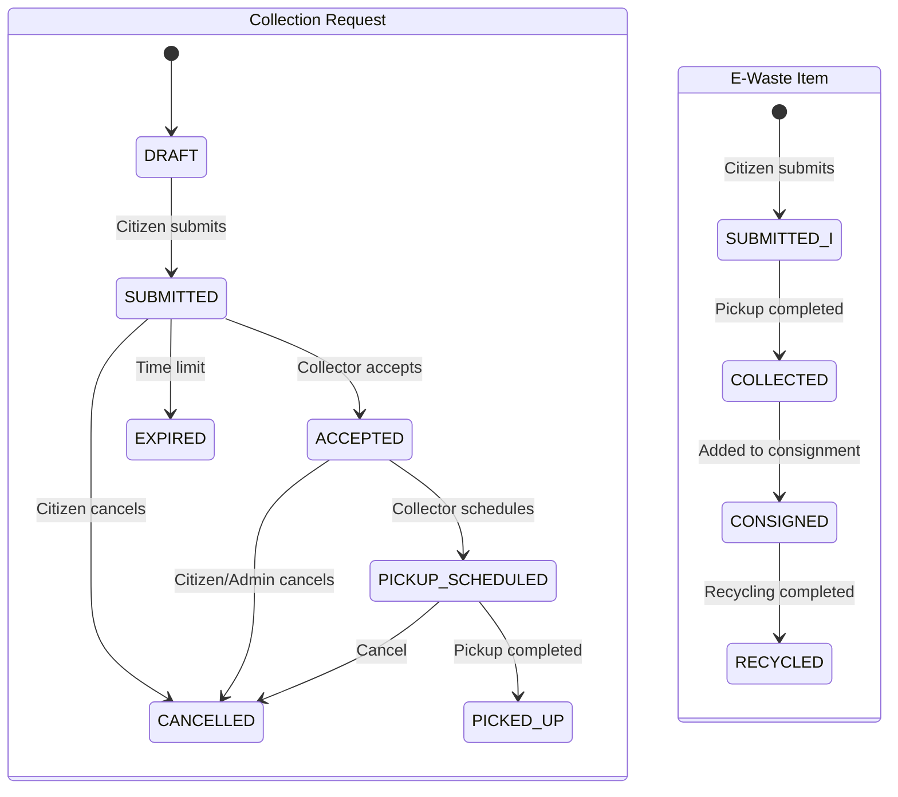

# EcoSetu — Business Workflows

> **Reference:** All terminology follows `00_PROJECT_INDEX.md`.

---

## 1. Citizen Workflow

### 1.1 E-Waste Submission and Collection Request

```mermaid
flowchart TD
    A["Citizen registers on Android App<br/>(ACTIVE immediately)"] --> B["Citizen submits<br/>e-waste item(s)"]
    B --> C{"Capture/Upload photo?"}
    C -->|Yes (Camera/Gallery)| D["AI suggests category<br/>(citizen can override)"]
    C -->|No| E["Citizen selects<br/>category manually"]
    D --> F["Item saved<br/>(status: SUBMITTED)"]
    E --> F
    F --> G["Citizen creates<br/>collection request"]
    G --> H["Set pickup address<br/>(GPS / Map selection)"]
    H --> I["Set preferred date/time<br/>(optional)"]
    I --> J["Submit request<br/>(status: SUBMITTED)"]
    J --> K["Wait for collector<br/>to accept"]
    K --> L["Android Notification:<br/>Collector accepted"]
    L --> M["Wait for pickup"]
    M --> N["Android Notification:<br/>Pickup completed"]
    N --> O["View traceability<br/>chain in app"]
```

### 1.2 Status Tracking

The citizen can check their request status at any time:

| Status | Citizen Sees |
|--------|-------------|
| `DRAFT` | "Your request is not yet submitted" |
| `SUBMITTED` | "Waiting for a collector to accept your request" |
| `ACCEPTED` | "A collector has accepted. Pickup will be scheduled." |
| `PICKUP_SCHEDULED` | "Pickup scheduled for [date]" |
| `PICKED_UP` | "Your items have been collected" |
| `CANCELLED` | "This request was cancelled" |
| `EXPIRED` | "This request has expired. Please create a new one." |

### 1.3 Cancellation

- Citizen can cancel a request in `DRAFT`, `SUBMITTED`, or `ACCEPTED` status
- Cannot cancel after `PICKED_UP`
- Must provide a cancellation reason
- If a collector has already accepted, they receive a cancellation notification

---

## 2. Informal Collector Workflow

### 2.1 Onboarding and Verification



### 2.2 Collection Process



### 2.3 Handover to Recycler



### 2.4 Availability Management

- Collector can toggle availability ON/OFF
- When OFF, they do not appear in request matching
- Useful for days off, travel, or capacity limits

---

## 3. Recycler Workflow

### 3.1 Onboarding and Verification



### 3.2 Receiving and Processing



---

## 4. Administrator Workflow

> **Platform Implementation Note:** For the MVP demonstration, core administrator tasks (verification approvals and activity monitoring) are managed directly via the **Admin View inside the Android Application**. An expansive multi-pane management console is marked as **FUTURE / DEFERRED** for the web portal.

### 4.1 User Verification Management



### 4.2 Platform Monitoring



### 4.3 Dispute Handling (Manual Process)

For the MVP, disputes are handled manually:

1. Admin reviews audit logs for the disputed transaction
2. Admin contacts involved parties (via platform data)
3. Admin makes a judgment based on available evidence
4. Admin can suspend accounts if misconduct is found
5. Admin creates an audit log entry documenting the resolution

> **Note:** There is no formal dispute resolution system in the MVP. Disputes are rare in a prototype and can be handled through admin intervention.

---

## 5. Complete End-to-End Flow



### State Transitions Summary



---

## 6. Business Rules

### 6.1 Collection Request Rules

| Rule | Description |
|------|-------------|
| BR-CR-01 | A request must contain at least 1 e-waste item |
| BR-CR-02 | Only one collector can accept a given request |
| BR-CR-03 | A request cannot be cancelled after status `PICKED_UP` |
| BR-CR-04 | An item can only belong to one active collection request |
| BR-CR-05 | Requests in `SUBMITTED` status for more than 7 days move to `EXPIRED` |

### 6.2 Pickup Rules

| Rule | Description |
|------|-------------|
| BR-PU-01 | Only the assigned collector can complete a pickup |
| BR-PU-02 | Pickup completion requires actual weight for each item |
| BR-PU-03 | Pickup completion changes all associated items to `COLLECTED` |

### 6.3 Consignment Rules

| Rule | Description |
|------|-------------|
| BR-CO-01 | Only items in `COLLECTED` status can be added to a consignment |
| BR-CO-02 | An item can only be in one active consignment |
| BR-CO-03 | Consignment can only be created to a verified recycler |
| BR-CO-04 | Only the receiving recycler can accept or reject a consignment |

### 6.4 Recycling Rules

| Rule | Description |
|------|-------------|
| BR-RR-01 | A recycling record is auto-created when a consignment is accepted |
| BR-RR-02 | Recycling completion changes all linked items to `RECYCLED` |
| BR-RR-03 | Recycling completion creates an audit log entry |

---

*All terminology in this document follows `00_PROJECT_INDEX.md`.*
