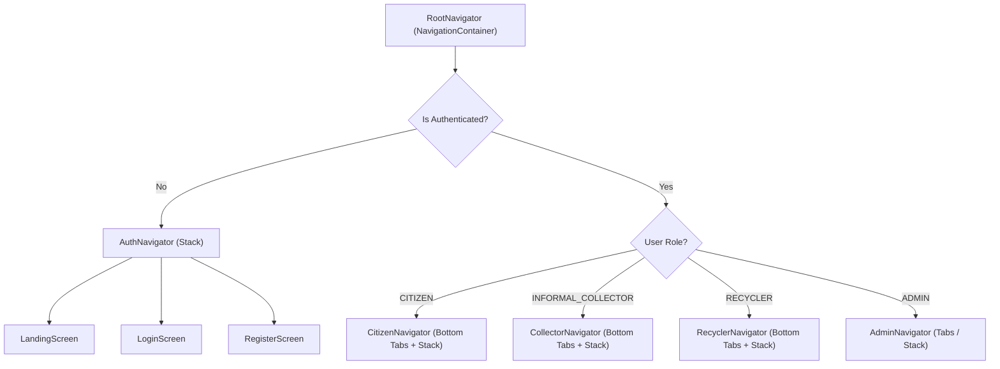

# EcoSetu — Android Application Architecture

> **Reference:** All terminology follows `00_PROJECT_INDEX.md`.

---

## 1. Overview

The primary client for EcoSetu is a native **Android Application** built with **React Native 0.73+** engineered to run reliably from Android 7.0+ (Nougat / API 24) up to the latest Android 16+ (API 35/36+). It leverages:

- **React Navigation v6** (Native Stack + Bottom Tab + Drawer Navigators) for touch-first mobile screen transitions
- **React Context + useReducer / custom hooks** for state management
- **React Native StyleSheet** with centralized Material Design tokens
- **Fetch API** with a resilient mobile API client (token injection, network timeouts, offline action queuing)
- **Native Android Hardware Access:**
  - **Camera & Gallery:** `react-native-vision-camera` / `react-native-image-picker` for capturing e-waste photos directly on-ground
  - **Geolocation:** `react-native-geolocation-service` for GPS-based pickup coordinates
  - **Image Compression:** `react-native-image-resizer` for client-side compression (< 1MB) prior to network upload
- **react-native-maps** with OpenStreetMap tiles / Google Maps provider
- **@react-native-async-storage/async-storage** for persistent JWT tokens, user preferences, and offline queues
- **Android Gradle Toolchain** (`android/` project producing installable `.apk` and `.aab` packages)

> **Future Web Application (FUTURE / DEFERRED):** A desktop browser web portal consuming the exact same backend REST APIs and database schema is planned for a future release to support heavy institutional bulk management and advanced administrative analytics.

---

## 2. Project Structure

```
mobile/                             # React Native Android Mobile Application
├── android/                        # Native Android Gradle Project
│   ├── app/
│   │   ├── build.gradle            # App build config (minSdkVersion 24, targetSdkVersion 35+, Android 7.0 to 16+)
│   │   └── src/main/
│   │       ├── AndroidManifest.xml # Permissions (CAMERA, ACCESS_FINE_LOCATION, POST_NOTIFICATIONS)
│   │       ├── java/               # MainApplication.kt & MainActivity.kt
│   │       └── res/                # App launcher icons, splash drawables, styles.xml
│   ├── build.gradle                # Project-level Gradle build configuration
│   ├── gradle.properties
│   └── gradlew                     # Android Gradle build wrapper
├── src/
│   ├── App.jsx                     # Root application entry with Providers & NavigationContainer
│   ├── assets/                     # Icons, brand logos, illustrations
│   ├── components/                 # Reusable UI components
│   │   ├── common/                 # Generic mobile UI components
│   │   │   ├── AppButton.jsx       # Custom button with ripple effect & loading spinner
│   │   │   ├── AppCard.jsx         # Surface card with 2dp elevation
│   │   │   ├── AppInput.jsx        # Outlined text input with inline error feedback
│   │   │   ├── AppModal.jsx        # Bottom sheet / dialog wrapper
│   │   │   ├── StatusBadge.jsx     # Color-coded pill badge
│   │   │   ├── Spinner.jsx         # Activity indicator
│   │   │   ├── EmptyState.jsx      # Icon + title + action button for empty lists
│   │   │   ├── ErrorBoundary.jsx   # Crash prevention wrapper
│   │   │   ├── Toast.jsx           # Bottom snackbar/toast feedback
│   │   │   └── Skeleton.jsx        # Shimmer placeholder loading component
│   │   ├── layout/                 # Layout & structure components
│   │   │   ├── TopAppBar.jsx       # Top header bar (title, back button, notification bell)
│   │   │   ├── BottomTabBar.jsx    # Custom role-based bottom navigation bar
│   │   │   ├── ScreenContainer.jsx # Safe area + keyboard avoiding scroll wrapper
│   │   │   └── RoleGuard.jsx       # Navigation role authorization guard
│   │   ├── forms/                  # Mobile input widgets
│   │   │   ├── CameraCapture.jsx   # Camera capture trigger with preview & retake
│   │   │   ├── MapPicker.jsx       # GPS map coordinate picker with draggable pin
│   │   │   ├── CategoryPicker.jsx  # Bottom sheet category selector
│   │   │   └── DateTimeModal.jsx   # Android native date/time picker
│   │   └── features/               # Feature-specific components
│   │       ├── TraceabilityTimeline.jsx # Vertical stepper of item recycling lifecycle
│   │       ├── NotificationBell.jsx     # Header bell with unread badge counter
│   │       ├── AIPredictionCard.jsx     # Card displaying YOLOv8 prediction & confidence
│   │       └── MetricCard.jsx           # Dashboard summary metrics card
│   ├── navigation/                 # Navigation structure
│   │   ├── RootNavigator.jsx       # Top-level auth state switch
│   │   ├── AuthNavigator.jsx       # Landing, Login, Registration stack
│   │   ├── CitizenNavigator.jsx    # Citizen bottom tabs + modal stack
│   │   ├── CollectorNavigator.jsx  # Collector bottom tabs + pickup execution stack
│   │   ├── RecyclerNavigator.jsx   # Recycler bottom tabs + processing stack
│   │   └── AdminNavigator.jsx      # Admin management tabs & verification queue
│   ├── screens/                    # Mobile screen views (1:1 with routes)
│   │   ├── auth/
│   │   │   ├── LandingScreen.jsx
│   │   │   ├── LoginScreen.jsx
│   │   │   └── RegisterScreen.jsx
│   │   ├── citizen/
│   │   │   ├── CitizenDashboardScreen.jsx
│   │   │   ├── SubmitItemScreen.jsx
│   │   │   ├── MyItemsScreen.jsx
│   │   │   ├── CreateRequestScreen.jsx
│   │   │   ├── RequestDetailScreen.jsx
│   │   │   └── ItemTraceabilityScreen.jsx
│   │   ├── collector/
│   │   │   ├── CollectorDashboardScreen.jsx
│   │   │   ├── AvailableRequestsScreen.jsx
│   │   │   ├── RequestDetailScreen.jsx
│   │   │   ├── PickupCompletionScreen.jsx
│   │   │   ├── CreateConsignmentScreen.jsx
│   │   │   ├── MyPickupsScreen.jsx
│   │   │   └── VerificationScreen.jsx
│   │   ├── recycler/
│   │   │   ├── RecyclerDashboardScreen.jsx
│   │   │   ├── IncomingConsignmentsScreen.jsx
│   │   │   ├── RecyclingRecordsScreen.jsx
│   │   │   └── VerificationScreen.jsx
│   │   ├── admin/
│   │   │   ├── AdminDashboardScreen.jsx
│   │   │   ├── VerificationQueueScreen.jsx
│   │   │   ├── UserManagementScreen.jsx
│   │   │   └── AuditLogsScreen.jsx
│   │   └── shared/
│   │       ├── ProfileScreen.jsx
│   │       └── NotificationsScreen.jsx
│   ├── context/                    # Context state providers
│   │   ├── AuthContext.jsx
│   │   ├── NotificationContext.jsx
│   │   └── NetworkContext.jsx
│   ├── hooks/                      # Custom hooks
│   │   ├── useAuth.js
│   │   ├── useApi.js
│   │   ├── useCamera.js
│   │   ├── useLocation.js
│   │   └── useNetwork.js
│   ├── services/                   # Business & network services
│   │   ├── apiClient.js            # Base Fetch wrapper with retry & timeout
│   │   ├── authService.js
│   │   ├── ewasteService.js
│   │   ├── requestService.js
│   │   ├── pickupService.js
│   │   ├── consignmentService.js
│   │   ├── recyclingService.js
│   │   ├── aiService.js
│   │   ├── locationService.js      # GPS location retrieval & reverse geocoding
│   │   ├── offlineQueue.js         # Offline action storage & synchronization
│   │   └── notificationService.js
│   ├── utils/                      # Helper utilities
│   │   ├── constants.js            # Canonical roles, statuses, categories
│   │   ├── permissions.js          # Android runtime permission helpers
│   │   ├── formatters.js           # Date, weight, and status formatters
│   │   └── storage.js              # AsyncStorage wrapper
│   └── theme/                      # Styling tokens
│       ├── colors.js
│       ├── typography.js
│       └── spacing.js
├── index.js                        # AppRegistry entry point
├── app.json                        # Application metadata
└── package.json
```

---

## 3. Component Architecture

### 3.1 Component Pattern

Each component is written as a functional React Native component using StyleSheet:

```jsx
import React from 'react';
import { View, Text, StyleSheet, TouchableOpacity } from 'react-native';
import { colors } from '../../theme/colors';

export const ComponentName = ({ title, onPress }) => {
  return (
    <TouchableOpacity style={styles.container} onPress={onPress} activeOpacity={0.7}>
      <Text style={styles.title}>{title}</Text>
    </TouchableOpacity>
  );
};

const styles = StyleSheet.create({
  container: {
    backgroundColor: colors.surface,
    padding: 16,
    borderRadius: 8,
    elevation: 2,
  },
  title: {
    fontSize: 16,
    color: colors.textPrimary,
    fontWeight: '500',
  },
});
```

---

## 4. Mobile Navigation Architecture

### 4.1 Navigation Hierarchy

The application uses **React Navigation 6**:



### 4.2 Screen Catalog

| Screen Name | Role | Navigation Type | Purpose |
|-------------|------|-----------------|---------|
| `Landing` | Public | Stack | Platform introduction and entry point |
| `Login` | Public | Stack | Email/password authentication |
| `Register` | Public | Stack | Account registration with role selection |
| `CitizenHome` | `CITIZEN` | Bottom Tab | Dashboard summary, active requests count |
| `CitizenSubmit` | `CITIZEN` | Bottom Tab | Camera photo capture, AI inference, item submit |
| `CitizenRequests` | `CITIZEN` | Bottom Tab | List of submitted collection requests |
| `CitizenNotifications` | `CITIZEN` | Bottom Tab | Unread alerts & pickup status updates |
| `CitizenProfile` | `CITIZEN` | Bottom Tab | User profile, sign out |
| `RequestDetail` | `CITIZEN` | Stack (Modal) | Stepper status, assigned collector info, cancel |
| `ItemTraceability` | `CITIZEN` | Stack (Modal) | Full chain of custody lifecycle stepper |
| `CollectorHome` | `INFORMAL_COLLECTOR` | Bottom Tab | Daily pickup stats, availability toggle |
| `CollectorBrowse` | `INFORMAL_COLLECTOR` | Bottom Tab | Nearby requests with map/list view toggle |
| `CollectorPickups` | `INFORMAL_COLLECTOR` | Bottom Tab | Active & completed pickup history |
| `CollectorConsign` | `INFORMAL_COLLECTOR` | Bottom Tab | Create consignment to authorized recycler |
| `CollectorProfile` | `INFORMAL_COLLECTOR` | Bottom Tab | Profile, verification status banner |
| `PickupExecution` | `INFORMAL_COLLECTOR` | Stack | Collect items, enter weight, capture camera photo |
| `RecyclerHome` | `RECYCLER` | Bottom Tab | Processing statistics, incoming consignments |
| `RecyclerIncoming` | `RECYCLER` | Bottom Tab | Review & accept/reject incoming deliveries |
| `RecyclerRecords` | `RECYCLER` | Bottom Tab | Recycling records, processing notes |
| `AdminHome` | `ADMIN` | Tab/Drawer | Platform overview, quick actions |
| `AdminVerifications`| `ADMIN` | Tab/Drawer | Review collector/recycler submitted IDs |
| `AdminUsers` | `ADMIN` | Tab/Drawer | User status controls (activate/suspend) |
| `AdminAuditLogs` | `ADMIN` | Tab/Drawer | Audit log inspection |

---

## 5. State Management

### 5.1 AuthContext

| State | Type | Purpose |
|-------|------|---------|
| `user` | Object | Current user profile (id, name, email, role, status) |
| `accessToken` | String | JWT access token |
| `isAuthenticated` | Boolean | True when valid token exists |
| `isLoading` | Boolean | True during initial AsyncStorage token retrieval |

**Storage:** The JWT token is securely stored in `@react-native-async-storage/async-storage` (key: `@ecosetu_token`) upon login and reloaded on app launch.

### 5.2 NetworkContext & Offline Handling

| State | Type | Purpose |
|-------|------|---------|
| `isConnected` | Boolean | Real-time cellular/Wi-Fi connection state |
| `pendingActionsCount` | Number | Number of queued actions waiting for sync |

**Offline Queue Workflow:**
1. When collector performs an action (e.g. saves pickup weight) in poor network conditions, the action is stored in `offlineQueue` in AsyncStorage.
2. The UI shows a subtle banner: *"Offline — action queued for synchronization"*.
3. When network connectivity restores, `offlineQueue.sync()` automatically flushes queued requests sequentially.

---

## 6. API Client & Hardware Integration

### 6.1 apiClient.js Mobile Pattern

1. **Base URL:** Loaded from environment config (`http://10.0.2.2:3001/api/v1` in emulator, live server in demo)
2. **Timeout:** Set to 15 seconds for regular calls, 30 seconds for image upload
3. **Auth Injection:** Automatically injects `Authorization: Bearer <token>` from AsyncStorage
4. **Retry Logic:** Automatic retry (1 retry with exponential backoff) for transient network timeouts

### 6.2 Camera & Image Pipeline

```text
Android Camera API (react-native-vision-camera / image-picker)
       ↓
Capture High-Resolution Image
       ↓
Client-Side Image Resizing & JPEG Compression (< 1MB)
       ↓
Multipart FormData Upload (`POST /api/v1/ewaste-items`)
       ↓
Backend stores image & invokes YOLOv8 FastAPI (`POST /predict`)
       ↓
Returns Prediction + Confidence Score to Android App
       ↓
UI displays AIPredictionCard with "Accept" / "Override" buttons
```

### 6.3 Android Runtime Permissions

Handled via `src/utils/permissions.js`:

| Permission | Reason Requested | When Requested |
|------------|------------------|----------------|
| `android.permission.CAMERA` | To photograph e-waste items and pickup proofs | When user taps "Take Photo" |
| `android.permission.ACCESS_FINE_LOCATION` | To capture pickup coordinates and find nearby requests | When user creates request or browses map |
| `android.permission.POST_NOTIFICATIONS` | To receive instant updates on pickups and verifications | On initial dashboard visit (Android 13+) |

---

## 7. Performance & Device Compatibility

| Concern | Implementation |
|---------|----------------|
| **Screen Sizes** | Responsive layouts using flexbox, percentage widths, and `Dimensions` API |
| **Android Versions** | Operates on Android 7.0 (Nougat / API 24) through latest modern flagships (Android 14, 15, and 16+ / API 35/36+) |
| **List Performance** | `FlatList` with `initialNumToRender={10}`, `maxToRenderPerBatch={10}`, and `windowSize={5}` |
| **App Size** | ProGuard / R8 enabled in release builds to strip unused code |

---

## 8. Android Build & Deployment

- **Debug Build:** `npx react-native run-android`
- **Release APK Build:**
  ```bash
  cd android
  ./gradlew assembleRelease
  ```
- **Output Artifact:** `android/app/build/outputs/apk/release/app-release.apk`
- Sideloadable directly onto physical Android smartphones for the SIH live presentation.

---

*All terminology in this document follows `00_PROJECT_INDEX.md`.*
