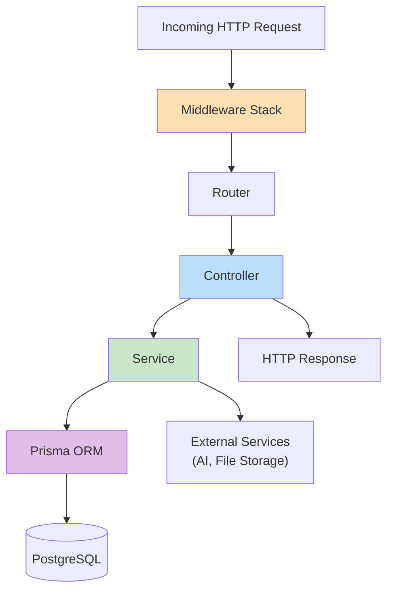
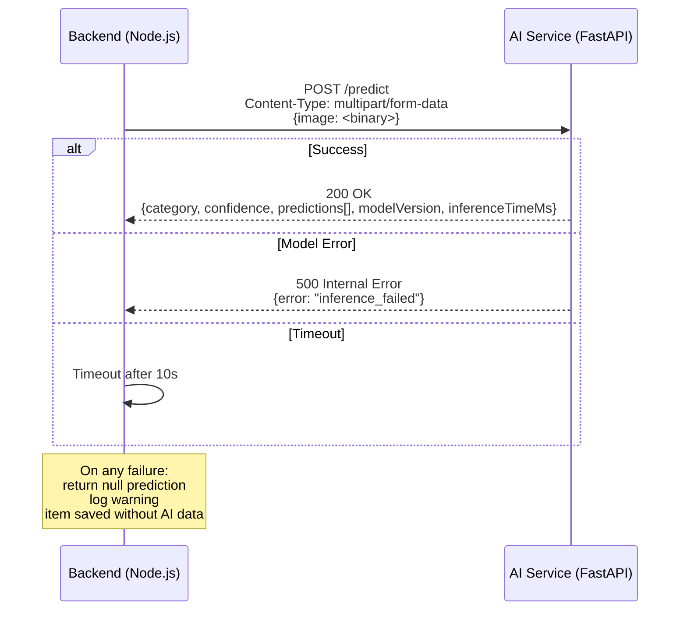

# EcoSetu — Backend Architecture

> **Reference:** All terminology follows `00_PROJECT_INDEX.md`.

---

## 1. Overview

The backend is a client-independent **Node.js + Express.js** REST API designed to serve the **EcoSetu Android Mobile Application** (and future deferred web portal). It handles:

- Authentication and role-based access control
- Business logic for all e-waste lifecycle workflows
- Database access via Prisma ORM
- Multipart file upload handling from Android devices
- Communication with the Python YOLOv8 AI microservice
- In-app and push notification event creation
- Immutable audit logging for e-waste traceability

---

## 2. Project Structure

```
backend/
├── src/
│   ├── index.js                     # Server entry point
│   ├── app.js                       # Express app setup (middleware, routes)
│   ├── config/
│   │   ├── database.js              # Prisma client initialization
│   │   ├── environment.js           # Environment variable loader + validation
│   │   ├── cors.js                  # CORS configuration
│   │   └── rateLimit.js             # Rate limiting configuration
│   ├── middleware/
│   │   ├── authenticate.js          # JWT verification
│   │   ├── authorize.js             # Role-based access check
│   │   ├── checkStatus.js           # Account status check (ACTIVE required)
│   │   ├── checkVerified.js         # Verification status check
│   │   ├── validate.js              # Request validation runner
│   │   ├── upload.js                # Multer file upload config
│   │   ├── errorHandler.js          # Centralized error handling
│   │   └── requestLogger.js         # Request/response logging
│   ├── routes/
│   │   ├── index.js                 # Route aggregator
│   │   ├── authRoutes.js
│   │   ├── userRoutes.js
│   │   ├── collectorRoutes.js
│   │   ├── recyclerRoutes.js
│   │   ├── ewasteRoutes.js
│   │   ├── requestRoutes.js
│   │   ├── pickupRoutes.js
│   │   ├── consignmentRoutes.js
│   │   ├── recyclingRoutes.js
│   │   ├── aiRoutes.js
│   │   ├── notificationRoutes.js
│   │   ├── verificationRoutes.js
│   │   └── adminRoutes.js
│   ├── controllers/
│   │   ├── authController.js
│   │   ├── userController.js
│   │   ├── collectorController.js
│   │   ├── recyclerController.js
│   │   ├── ewasteController.js
│   │   ├── requestController.js
│   │   ├── pickupController.js
│   │   ├── consignmentController.js
│   │   ├── recyclingController.js
│   │   ├── aiController.js
│   │   ├── notificationController.js
│   │   ├── verificationController.js
│   │   └── adminController.js
│   ├── services/
│   │   ├── authService.js           # Password hashing, JWT generation
│   │   ├── userService.js           # User CRUD
│   │   ├── collectorService.js      # Collector profile operations
│   │   ├── recyclerService.js       # Recycler profile operations
│   │   ├── ewasteService.js         # E-waste item operations
│   │   ├── requestService.js        # Collection request logic
│   │   ├── pickupService.js         # Pickup operations
│   │   ├── consignmentService.js    # Consignment operations
│   │   ├── recyclingService.js      # Recycling record operations
│   │   ├── aiService.js             # AI microservice communication
│   │   ├── notificationService.js   # Notification creation
│   │   ├── verificationService.js   # Verification operations
│   │   ├── auditService.js          # Audit log creation
│   │   ├── fileService.js           # File upload/storage
│   │   └── analyticsService.js      # Analytics queries
│   ├── validators/
│   │   ├── authValidators.js
│   │   ├── ewasteValidators.js
│   │   ├── requestValidators.js
│   │   ├── pickupValidators.js
│   │   ├── consignmentValidators.js
│   │   ├── recyclingValidators.js
│   │   └── adminValidators.js
│   ├── utils/
│   │   ├── AppError.js              # Custom error class
│   │   ├── constants.js             # Canonical roles, statuses, categories
│   │   ├── responseHelper.js        # Standard response formatters
│   │   └── locationHelper.js        # Distance calculation (Haversine)
│   └── jobs/                        # Background tasks (if needed)
│       └── expireRequests.js        # Mark old SUBMITTED requests as EXPIRED
├── prisma/
│   ├── schema.prisma                # Database schema
│   ├── migrations/                  # Generated migrations
│   └── seed.js                      # Seed data script
├── .env.example
├── package.json
└── jest.config.js
```

---

## 3. Architecture Layers



### Layer Responsibilities

| Layer | Responsibility | Does NOT |
|-------|---------------|----------|
| **Middleware** | Auth, validation, rate limiting, logging | Contain business logic |
| **Router** | Maps routes to controllers | Contain logic |
| **Controller** | Parse request, call service, format response | Access database directly |
| **Service** | Business logic, orchestration | Handle HTTP concerns |
| **Prisma/ORM** | Database queries | Contain business rules |
| **Utils** | Shared helpers | Contain state |

---

## 4. Middleware Stack

Middleware executes in this order for every request:

```
1. CORS
2. Request body parser (JSON, 10KB limit)
3. Request logger (winston)
4. Rate limiter
5. Route matching
6. [Per-route middleware]:
   6a. authenticate (JWT verify)
   6b. authorize(allowedRoles)
   6c. checkStatus (ACTIVE required)
   6d. checkVerified (for operational endpoints)
   6e. validate (express-validator)
7. Controller
8. Error handler (catches all thrown errors)
```

### 4.1 authenticate Middleware

1. Extract token from `Authorization: Bearer <token>`
2. Verify JWT signature and expiration
3. Fetch user from database by token's `userId`
4. Attach `req.user` = `{ id, email, role, status }`
5. If invalid/expired → `401 UNAUTHORIZED`

### 4.2 authorize Middleware

```
authorize('CITIZEN', 'ADMIN')
```

1. Check `req.user.role` against allowed roles
2. If not in list → `403 FORBIDDEN`

### 4.3 checkVerified Middleware

1. If user role is `INFORMAL_COLLECTOR` or `RECYCLER`
2. Check `req.user.status === 'ACTIVE'`
3. If not → `403 FORBIDDEN` with message "Account not yet verified"

### 4.4 Error Handler

Centralized error handling middleware:

| Error Type | Status | Response |
|-----------|--------|----------|
| `AppError` (custom) | Defined in error | `{ success: false, error: { code, message, details } }` |
| Prisma validation | 400 | Formatted validation error |
| Prisma not found | 404 | Resource not found |
| Prisma unique constraint | 409 | Conflict |
| JWT errors | 401 | Unauthorized |
| Multer errors | 400 | File upload error |
| Unknown errors | 500 | Generic internal error (details logged, not exposed) |

---

## 5. Service Layer Detail

### 5.1 authService

| Method | Purpose |
|--------|---------|
| `hashPassword(plaintext)` | bcrypt hash with 10 salt rounds |
| `comparePassword(plaintext, hash)` | bcrypt compare |
| `generateAccessToken(user)` | JWT with 15min expiry |
| `generateRefreshToken(user)` | JWT with 7day expiry |
| `verifyToken(token, type)` | Verify and decode JWT |

### 5.2 fileService

| Method | Purpose |
|--------|---------|
| `uploadImage(file, folder)` | Upload to local/Cloudinary based on env |
| `deleteImage(url)` | Remove stored image |
| `validateImage(file)` | Check type (JPEG/PNG), size (<5MB), and magic bytes |

**File validation:**
1. Check MIME type matches extension
2. Check file magic bytes (first bytes) match claimed type
3. Reject if mismatch (prevents disguised file uploads)

### 5.3 aiService

| Method | Purpose |
|--------|---------|
| `predictCategory(imageBuffer)` | Send image to FastAPI AI service, return prediction |

Handles AI service unavailability gracefully:
- Timeout: 10 seconds
- On failure: returns `null` (controller returns item without prediction)
- Logged as warning, not error

### 5.4 notificationService

| Method | Purpose |
|--------|---------|
| `create(userId, type, title, message, referenceType, referenceId)` | Create in-app notification |
| `createForRole(role, type, title, message)` | Notify all users of a role |
| `getUnreadCount(userId)` | Count unread notifications |

### 5.5 auditService

| Method | Purpose |
|--------|---------|
| `log(actorId, action, entityType, entityId, details, ip)` | Create immutable audit entry |

Called from services, not controllers. Key audit events:

| Action | Trigger |
|--------|---------|
| `USER_REGISTERED` | New registration |
| `USER_VERIFIED` | Admin approves verification |
| `USER_SUSPENDED` | Admin suspends account |
| `REQUEST_SUBMITTED` | Collection request submitted |
| `REQUEST_ACCEPTED` | Collector accepts request |
| `PICKUP_COMPLETED` | Pickup finished |
| `CONSIGNMENT_CREATED` | Consignment created |
| `CONSIGNMENT_ACCEPTED` | Recycler accepts |
| `CONSIGNMENT_REJECTED` | Recycler rejects |
| `RECYCLING_COMPLETED` | Recycling finished |

---

## 6. Database Access

### 6.1 Prisma Client

- Single Prisma Client instance shared across the application
- Initialized in `config/database.js`
- Connection string from `DATABASE_URL` environment variable
- Connection pooling handled by Prisma

### 6.2 Transaction Pattern

Multi-step operations use Prisma transactions:

Example: Completing a pickup requires:
1. Update pickup status → `COMPLETED`
2. Update collection request status → `PICKED_UP`
3. Update all item statuses → `COLLECTED`
4. Update collector's `total_pickups` counter
5. Create notification for citizen
6. Create audit log entry

All within a single `prisma.$transaction()`.

---

## 7. Environment Variables

| Variable | Description | Required | Example |
|----------|-------------|:--------:|---------|
| `NODE_ENV` | Environment | Yes | `development` |
| `PORT` | Server port | Yes | `3001` |
| `DATABASE_URL` | PostgreSQL connection string | Yes | `postgresql://...` |
| `JWT_ACCESS_SECRET` | Access token signing secret | Yes | Random 64-char string |
| `JWT_REFRESH_SECRET` | Refresh token signing secret | Yes | Random 64-char string |
| `JWT_ACCESS_EXPIRY` | Access token TTL | No | `15m` (default) |
| `JWT_REFRESH_EXPIRY` | Refresh token TTL | No | `7d` (default) |
| `CORS_ORIGIN` | Allowed frontend origin | Yes | `http://localhost:5173` |
| `AI_SERVICE_URL` | AI microservice URL | No | `http://localhost:8000` |
| `CLOUDINARY_CLOUD_NAME` | Cloudinary cloud name | No | `my-cloud` |
| `CLOUDINARY_API_KEY` | Cloudinary API key | No | — |
| `CLOUDINARY_API_SECRET` | Cloudinary API secret | No | — |
| `UPLOAD_DIR` | Local upload directory | No | `./uploads` |
| `LOG_LEVEL` | Winston log level | No | `info` |

---

## 8. Logging

### 8.1 Winston Configuration

| Level | Usage |
|-------|-------|
| `error` | Unhandled errors, database failures |
| `warn` | AI service unavailable, rate limit hits |
| `info` | Request summaries, auth events, business events |
| `debug` | Database queries, detailed flow (dev only) |

### 8.2 Log Format

- **Development:** Colorized console output
- **Production:** JSON format for structured logging

### 8.3 What Is Logged

| Event | Level | Details |
|-------|-------|---------|
| Incoming request | `info` | Method, path, user ID (if auth'd) |
| Response sent | `info` | Status code, response time |
| Auth failure | `warn` | IP, attempted email |
| Validation error | `info` | Fields that failed |
| Database error | `error` | Error message (no query params with sensitive data) |
| AI service call | `info` | Prediction result, inference time |
| AI service failure | `warn` | Error type, retry status |

### 8.4 What Is NOT Logged

- Passwords (plain or hashed)
- JWT tokens
- Full request bodies with sensitive data
- File contents

---

## 9. Background Jobs

### 9.1 Request Expiration

Requests in `SUBMITTED` status for more than 7 days should move to `EXPIRED`.

**Implementation options (choose one):**

1. **Cron-based:** Use `node-cron` to run a cleanup query every hour
2. **On-access:** Check expiration when querying available requests

Option 2 is simpler for a prototype and avoids the need for a background process.

---

## 10. AI Microservice Communication



The AI service is **optional**. The backend functions fully without it. When the AI service is unavailable:

- Item submission works (manual category selection)
- No error shown to the user
- Warning logged server-side
- AI endpoints return `503 Service Unavailable`

---

*All terminology in this document follows `00_PROJECT_INDEX.md`.*
