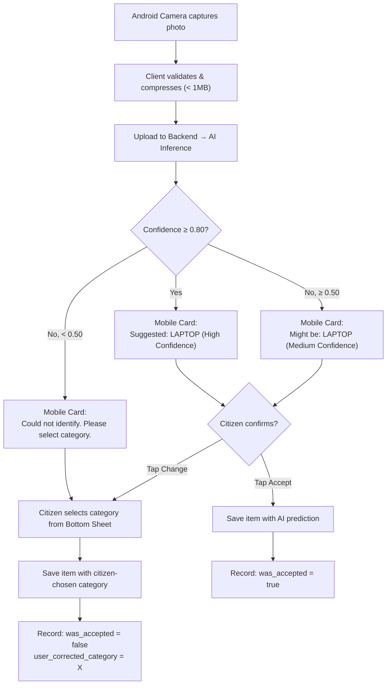

# EcoSetu — AI E-Waste Detection System

> **Reference:** All terminology follows `00_PROJECT_INDEX.md`.

---

## 1. Purpose

The AI component assists citizens in identifying e-waste categories by analyzing photos captured directly using their Android smartphone camera. It is an **assistive tool** — users always have the option to override or ignore predictions.

**The AI is NOT:**
- Required for platform operation
- An infallible authority
- A replacement for manual selection
- A critical system dependency

---

## 2. Supported Categories

The model targets the following canonical e-waste categories:

| Category | AI Target | Difficulty | Notes |
|----------|:---------:|-----------|-------|
| `MOBILE_PHONE` | ✅ | Low | Distinctive shape, well-represented in datasets |
| `LAPTOP` | ✅ | Low | Distinctive shape, common in datasets |
| `DESKTOP` | ✅ | Medium | Tower cases vary significantly |
| `TABLET` | ✅ | Medium | Similar to phones; size context may be lost |
| `MONITOR` | ✅ | Low | Distinctive rectangular shape |
| `PRINTER` | ✅ | Medium | Variable form factors |
| `KEYBOARD_MOUSE` | ✅ | Low | Distinctive shapes |
| `CABLE_CHARGER` | ⚠️ | High | Small, varied shapes; often tangled |
| `BATTERY` | ⚠️ | High | Small, varied; safety-critical identification |
| `CIRCUIT_BOARD` | ⚠️ | High | Only visible if device is disassembled |
| `OTHER` | ❌ | N/A | Catch-all; not a detection target |

> **Honest assessment:** Expect reasonable accuracy (>70%) for phones, laptops, monitors, keyboards. Expect lower accuracy for cables, batteries, and circuit boards. These classes may be excluded from initial model or grouped.

---

## 3. Detection vs Classification

### Decision: **Image Classification** (not object detection)

| Approach | What It Does | Pros | Cons |
|----------|-------------|------|------|
| **Classification** | Assigns a single category label to the entire image | Simpler, faster, smaller model, less training data needed | Assumes one item per image |
| **Object Detection** | Locates and identifies multiple objects with bounding boxes | Handles multiple items, provides location | Needs bounding box annotations, more complex, more data |

**Rationale:** For the MVP, citizens are likely to photograph one item at a time. Classification is simpler to train, requires less annotation effort, and is faster to deploy. If multiple-item detection becomes needed, YOLOv8 supports both — the switch is a configuration change.

**Fallback plan:** If classification proves insufficient, switch to YOLOv8 detection mode. The Ultralytics API is nearly identical for both.

---

## 4. Model Strategy

### 4.1 Pretrained Model

**Base model:** YOLOv8n-cls (nano classification variant)

| Attribute | Value |
|-----------|-------|
| Model | `yolov8n-cls.pt` |
| Pretrained on | ImageNet (1000 classes) |
| Parameters | ~3.5M |
| Size | ~6MB |
| CPU inference | ~50-200ms per image |
| Why nano? | Fast CPU inference, small memory footprint, sufficient for 10 classes |

### 4.2 Fine-Tuning Strategy

1. **Start with pretrained ImageNet weights** — provides general visual feature extraction
2. **Replace the classification head** — from 1000 ImageNet classes to our 10 e-waste classes
3. **Fine-tune on e-waste dataset** — train the new head + unfreeze last few layers
4. **Evaluate rigorously** — measure real performance, not assumed performance

### 4.3 Why Not Train From Scratch?

- ImageNet pretrained features (edges, textures, shapes) transfer well to electronics
- Training from scratch requires 10x more data
- Fine-tuning achieves good results with 100-500 images per class

---

## 5. Dataset Requirements

### 5.1 Data Sources

| Source | Type | Availability |
|--------|------|:------------:|
| Open Images Dataset (Google) | Labeled images of electronics | ✅ Free |
| ImageNet (electronics subsets) | Classification images | ✅ Free |
| Manually collected photos | Custom e-waste images | ✅ Free (time cost) |
| Web scraping (Creative Commons) | Supplementary images | ✅ Free |

> **No expensive dataset is required.** A fine-tuning dataset of **200-500 images per class** is sufficient for a prototype. This can be assembled from open datasets + 50-100 manually taken photos per class.

### 5.2 Dataset Size Estimate

| Class | Target Images | Easily Available? |
|-------|:------------:|:-----------------:|
| `MOBILE_PHONE` | 300-500 | Yes (Open Images, web) |
| `LAPTOP` | 300-500 | Yes |
| `DESKTOP` | 200-400 | Yes |
| `TABLET` | 200-400 | Moderate |
| `MONITOR` | 300-500 | Yes |
| `PRINTER` | 200-300 | Moderate |
| `KEYBOARD_MOUSE` | 300-500 | Yes |
| `CABLE_CHARGER` | 100-200 | Challenging |
| `BATTERY` | 100-200 | Challenging |
| `CIRCUIT_BOARD` | 100-200 | Moderate |

**Total estimated dataset: 2,000-4,000 images**

### 5.3 Class Imbalance

Some classes will have more available images than others. Mitigation:

1. **Augmentation** — Apply heavier augmentation to underrepresented classes
2. **Weighted loss** — Use class weights inversely proportional to frequency
3. **Minimum threshold** — Exclude classes with fewer than 50 training images
4. **Grouping** — Consider grouping `CABLE_CHARGER`, `BATTERY`, `CIRCUIT_BOARD` into "Small Components" if individual classes perform poorly

### 5.4 Dataset Quality

| Requirement | Description |
|-------------|-------------|
| **Variety** | Different angles, lighting, backgrounds per class |
| **Realistic** | Photos similar to what users would actually take (smartphone photos, home backgrounds) |
| **Clean labels** | Each image correctly labeled; ambiguous images excluded |
| **No duplicates** | Remove exact duplicates and near-duplicates |
| **Balanced lighting** | Include well-lit and poorly-lit examples |

---

## 6. Annotation Requirements

For **classification**, annotation is simple: each image gets a single label (the directory name).

Dataset structure:
```
dataset/
├── train/
│   ├── MOBILE_PHONE/
│   │   ├── img_001.jpg
│   │   └── ...
│   ├── LAPTOP/
│   └── ...
├── val/
│   ├── MOBILE_PHONE/
│   └── ...
└── test/
    ├── MOBILE_PHONE/
    └── ...
```

No bounding box annotation needed for classification.

---

## 7. Data Augmentation

| Augmentation | Purpose | Settings |
|-------------|---------|----------|
| Random horizontal flip | Orientation invariance | 50% probability |
| Random rotation | Angle invariance | ±15 degrees |
| Color jitter | Lighting robustness | Brightness ±20%, contrast ±20% |
| Random crop + resize | Scale invariance | 80-100% of original |
| Gaussian blur | Focus robustness | Kernel 3-5, 20% probability |

**NOT recommended for this task:**
- Vertical flip (electronics don't appear upside-down normally)
- Heavy color distortion (may change distinctive features)
- Cutout/erasing (may remove key identifying features)

---

## 8. Training Pipeline

### 8.1 Train/Validation/Test Split

| Split | Percentage | Purpose |
|-------|:---------:|---------|
| Train | 70% | Model training |
| Validation | 15% | Hyperparameter tuning, early stopping |
| Test | 15% | Final evaluation only (never used during training) |

**Splitting rules:**
- Split by image, not by augmented variant
- Stratified split to maintain class ratios
- If images from the same source/session exist, keep them in the same split

### 8.2 Training Configuration

| Parameter | Value | Rationale |
|-----------|-------|-----------|
| Base model | `yolov8n-cls.pt` | Smallest YOLOv8 variant; fast on CPU |
| Image size | 224×224 | Standard for classification |
| Batch size | 32 | Fits in CPU/basic GPU memory |
| Epochs | 50-100 | With early stopping (patience=10) |
| Learning rate | 0.001 (initial) | With cosine annealing |
| Optimizer | AdamW | Default for YOLOv8 |
| Early stopping | Patience=10 | Stop if val loss doesn't improve |

### 8.3 Compute Requirements

| Resource | Minimum | Recommended |
|----------|---------|-------------|
| CPU | Any modern multi-core | 4+ cores |
| RAM | 8GB | 16GB |
| GPU | Not required | Any CUDA GPU (speeds up training 5-10x) |
| Disk | 5GB (dataset + model) | 10GB |
| Training time (CPU) | 2-6 hours | — |
| Training time (GPU) | 15-60 minutes | — |

### 8.4 Free Training Options

| Option | Details |
|--------|---------|
| **Google Colab (free)** | T4 GPU, 12hr sessions; good for training |
| **Kaggle Notebooks** | P100 GPU, 30hr/week; good for training |
| **Local CPU** | Slower but works; 2-6 hours for this dataset size |

---

## 9. Evaluation

### 9.1 Metrics

| Metric | What It Measures | Target (Honest) |
|--------|-----------------|:---------------:|
| **Overall Accuracy** | % of images correctly classified | > 70% |
| **Per-Class Precision** | Of images predicted as class X, how many are correct? | > 60% per class |
| **Per-Class Recall** | Of actual class X images, how many were found? | > 60% per class |
| **F1 Score** | Harmonic mean of precision and recall | > 65% |
| **Confusion Matrix** | Which classes get confused with each other | Inspect manually |
| **Top-2 Accuracy** | Correct class in top 2 predictions | > 85% |

> **These targets are estimates.** Actual performance depends on dataset quality and will be measured — not assumed.

### 9.2 Expected Confusion Patterns

| Likely Confusion | Why |
|-----------------|-----|
| TABLET ↔ MOBILE_PHONE | Similar form factor; size context lost in photos |
| DESKTOP ↔ PRINTER | Some form factors look similar |
| CABLE_CHARGER ↔ OTHER | High visual variability |
| BATTERY ↔ OTHER | Small, nondescript |

### 9.3 Confidence Thresholds

| Confidence Range | Action |
|:----------------:|--------|
| ≥ 0.80 | Show prediction as "Suggested: [category]" |
| 0.50 - 0.79 | Show prediction as "This might be: [category] (low confidence)" |
| < 0.50 | Show "Could not identify. Please select manually." |

---

## 10. Inference

### 10.1 Inference Pipeline

```text
Android Camera (or Gallery)
       ↓
Capture High-Resolution E-Waste Image
       ↓
Client-Side Image Validation & JPEG Compression (< 1MB)
       ↓
Upload to Backend (POST /api/v1/ewaste-items as multipart/form-data)
       ↓
Backend Validates & Forwards to FastAPI AI Service (POST /predict)
       ↓
YOLOv8 Execution:
  1. Load & preprocess image (resize 224×224, normalize)
  2. Forward pass through YOLOv8n-cls
  3. Softmax activation
  4. Return predicted category + confidence distribution
       ↓
Backend records prediction in ai_predictions table
       ↓
Returns Prediction + Confidence to Android Application
       ↓
User Confirmation / Manual Override in Mobile UI
```

### 10.2 AI Service API

```
POST /predict
Content-Type: multipart/form-data
Body: {image: <file>}

Response 200:
{
  "category": "LAPTOP",
  "confidence": 0.92,
  "predictions": [
    {"category": "LAPTOP", "confidence": 0.92},
    {"category": "TABLET", "confidence": 0.05},
    {"category": "MONITOR", "confidence": 0.02}
  ],
  "model_version": "v1.0",
  "inference_time_ms": 180
}
```

### 10.3 Inference Performance

| Metric | Target |
|--------|--------|
| Latency (CPU) | < 500ms per image |
| Latency (GPU) | < 100ms per image |
| Memory | < 500MB (model + runtime) |
| Throughput | 5-10 requests/second (CPU) |

---

## 11. Human Correction Loop



The correction data (accepted vs. overridden predictions) is stored in `ai_predictions` and can be used for:

- Monitoring model quality in production
- Identifying systematic misclassifications
- Building a curated dataset for future retraining

---

## 12. Failure Cases

| Failure | Handling |
|---------|---------|
| AI service is down | Return `503`; frontend falls back to manual selection |
| AI service times out | 10-second timeout; same as service down |
| Image is too dark/blurry | Low confidence prediction; user selects manually |
| Multiple items in frame | Model predicts most prominent item; may be incorrect; user corrects |
| Non-electronics in image | Low confidence or incorrect prediction; user selects manually |
| Image format not supported | Rejected at upload validation (before AI) |

---

## 13. Model Versioning

| Attribute | Convention |
|-----------|-----------|
| Version format | `v{major}.{minor}` (e.g., `v1.0`, `v1.1`, `v2.0`) |
| Stored in | Model filename + `ai_predictions.model_version` |
| Model file naming | `ewaste_classifier_v1.0.pt` |
| When to version | Any retrained model gets a new version |

---

## 14. Model Deployment

### 14.1 AI Service Architecture

```
ai/
├── src/
│   ├── main.py           # FastAPI application
│   ├── model.py           # Model loading and prediction
│   ├── config.py          # Configuration
│   └── schemas.py         # Pydantic response schemas
├── models/
│   └── ewaste_classifier_v1.0.pt
├── requirements.txt
├── Dockerfile (optional)
└── README.md
```

### 14.2 Deployment Options

| Option | Setup | Pro | Con |
|--------|-------|-----|-----|
| **Same Render instance** | Deploy alongside backend | Simple | Consumes shared resources |
| **Separate Render instance** | Dedicated service | Isolated scaling | Uses second free-tier slot |
| **Local only** | Run during development/demo | Full control | Not cloud-hosted |

**Recommendation:** Separate Render instance for the AI service. This isolates the Python environment and allows the AI to be deployed/updated independently.

---

## 15. Privacy

- Uploaded images are stored only for the item record (not for AI training automatically)
- AI predictions are logged for quality monitoring only
- No personal information is sent to the AI service — only the image
- Images are never sent to third-party AI services

---

## 16. Future Improvements

These are NOT in the MVP:

1. **Object detection mode** — Detect multiple items per image
2. **Model retraining pipeline** — Use correction data for periodic retraining
3. **On-device inference** — Run model in browser using ONNX.js or TensorFlow.js
4. **Hazardous material detection** — Flag batteries and circuit boards with safety warnings
5. **Condition assessment** — Predict item condition (working/damaged) from image
6. **Brand/model recognition** — Identify specific product brands for value estimation

---

*All terminology in this document follows `00_PROJECT_INDEX.md`.*
