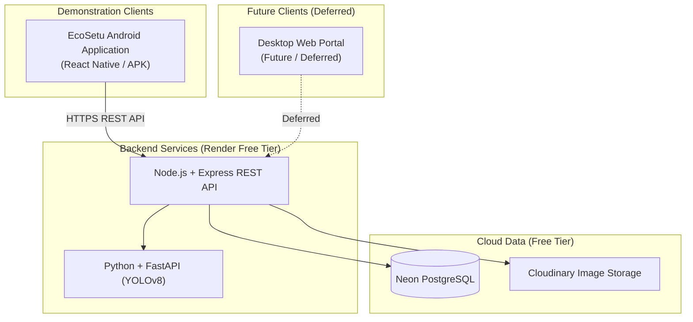

# EcoSetu — SIH Presentation Content

> **Reference:** All terminology follows `00_PROJECT_INDEX.md`.

---

## 1. Problem Statement

India generates approximately **3.2 million tonnes** of e-waste annually (Global E-waste Monitor 2024), growing at **~10% per year**. An estimated **90%+** of this e-waste is handled by the informal sector — kabadiwalas, street waste-pickers, and local aggregators.

**The core problem:** The informal e-waste collection sector operates entirely outside formal recycling systems. Without a structured technological bridge, material disappears into unregulated backyards for toxic open-air cable burning and acid leaching, creating severe health hazards and zero traceability.

---

## 2. Existing Gap

| Current State | What's Missing |
|--------------|---------------|
| Citizens accumulate old electronics at home | No convenient, responsible disposal channel |
| Kabadiwalas collect scrap door-to-door | No formal identity or digital verification |
| Recyclers need documented material for compliance | No transparent supply chain documentation |
| Regulators need data for EPR enforcement | No visibility into informal collection volumes |
| E-waste enters unregulated channels | No traceability from generation to recycling |

**EcoSetu connects all three stakeholders into a unified, traceable mobile loop.**

---

## 3. Proposed Solution

**EcoSetu** is an **Android mobile application** that creates a traceable chain from e-waste generation to formal recycling by connecting:

1. **Citizens** — Photograph e-waste using smartphone camera, get AI identification, and request doorstep pickup
2. **Informal Collectors (Kabadiwalas)** — Discover nearby requests, verify weights, complete pickups with photo proof, and deliver to authorized recyclers
3. **Authorized Recyclers** — Receive documented consignments, log processing, and certify recycling completion

Every transaction is recorded, timestamped, GPS-tagged, and auditable — establishing end-to-end chain of custody.

---

## 4. Innovation

| Innovation | Description |
|-----------|-------------|
| **Formalization without displacement** | Integrates grassroots informal collectors into the formal chain without replacing them — preserving livelihoods while instituting accountability |
| **On-device AI categorization** | Mobile camera capture coupled with YOLOv8 computer vision helps citizens instantly classify e-waste categories and view confidence metrics |
| **End-to-end traceability** | Every e-waste item is tracked: Submission → Collector Pickup → Recycler Consignment → Certified Recycling |
| **Mobile-first field operation** | Tailored for real-world field conditions: large touch targets, low-bandwidth image compression (< 1MB), and offline action resilience |
| **Location-based discovery** | Connects citizens with nearby verified collectors using device GPS coordinates |

---

## 5. Architecture Summary

- **Client Platform (MVP):** Android Mobile Application (React Native 0.73+ / Android Gradle APK)
- **Backend:** Node.js 20 LTS + Express.js + Prisma ORM
- **Database:** PostgreSQL (Neon free tier)
- **AI Microservice:** Python 3.10+ + FastAPI + Ultralytics YOLOv8n-cls
- **Maps & Location:** `react-native-maps` + device GPS sensors
- **Companion Web Portal:** **FUTURE / DEFERRED** (planned for future desktop enterprise use)

---

## 6. AI Contribution

| Aspect | Detail |
|--------|--------|
| **Task** | E-waste image classification |
| **Model** | YOLOv8n-cls fine-tuned on e-waste categories |
| **Input** | Smartphone camera photo of electronic waste |
| **Output** | Category prediction + confidence score |
| **Categories** | 10 canonical e-waste categories |
| **Role** | Assistive — citizen retains full power to accept or override |
| **Data Efficiency** | Client-side compression (< 1MB) prevents excessive mobile data usage |
| **Fallback** | Manual selection always available if AI service is offline |

> **Honest claim:** The AI assists category identification to reduce input friction. It never replaces human discretion.

---

## 7. Social & Environmental Impact

| Stakeholder / Area | Concrete Impact |
|-------------------|-----------------|
| **Informal collectors** | Formal digital identity, verified credentials, steady collection demand, direct access to authorized recyclers |
| **Citizens** | Convenient home pickup, transparent confirmation that e-waste is recycled cleanly |
| **Environment** | Diverts toxic electronics from backyard acid leaching and open-air burning; increases critical mineral recovery |
| **Regulators (CPCB/SPCB)**| Provides empirical data on informal collection flows to support EPR compliance |

---

## 8. Feasibility & Sustainability

| Factor | Assessment |
|--------|-----------|
| **Technical** | Proven open-source technologies (React Native Android, Node.js, PostgreSQL, YOLOv8) |
| **Economic** | Zero infrastructure cost for prototype demonstration using free cloud tiers |
| **Grassroots Usability** | Native Android app operates smoothly on budget smartphones (Android 7.0+) through the latest Android 16+ flagships |
| **Client-Independent API** | Clean REST API design allows adding future desktop web portals without backend rewrite |

---

## 9. Future Scope

| Enhancement | Description | When |
|-------------|-------------|------|
| Web Management Portal | Desktop browser dashboard for institutions, recyclers, and government auditors | Post-SIH (Deferred) |
| Payment integration | UPI / digital wallet integration for formal instant settlements | Phase 2 |
| National EPR integration | Direct API bridge to CPCB Extended Producer Responsibility portal | When APIs available |
| Vernacular Voice Support | Hindi and Marathi voice prompts for low-literacy collectors | Phase 2 |
| Route Optimization | GPS-guided batch collection routing for informal aggregators | Phase 2 |

---

## 10. Demonstration Storyline

1. **Open:** Highlight India's 3.2M tonne e-waste challenge and the informal sector's dominant 90% collection reach.
2. **Introduce:** Present **EcoSetu** on an Android phone as the digital bridge formalizing collectors without displacing them.
3. **Live Demonstration:**
   - Citizen snaps photo of e-waste using Android camera → YOLOv8 identifies item with confidence score.
   - Citizen schedules pickup using device GPS location.
   - Admin verifies collector on mobile interface.
   - Collector discovers request on in-app map, accepts, logs weight, and captures camera handover proof.
   - Consignment handed over to authorized recycler for clean processing.
4. **Prove Traceability:** Open Citizen Traceability view showing end-to-end verified chain of custody.
5. **Close:** Emphasize environmental formalization, informal livelihood protection, and future web expansion.

---

## Key Presentation Phrases

- *"EcoSetu: Bringing the informal collector into the formal recycling chain."*
- *"Formalization without displacement — empowering grassroots collectors with digital identity."*
- *"End-to-end lifecycle traceability from citizen doorstep to authorized recycling."*
- *"AI-assisted camera scanning with complete human agency."*
- *"Android-first for field reality, cloud-ready for national scalability."*

---

*All content in this document is technically validated and aligned with the prototype implementation.*
