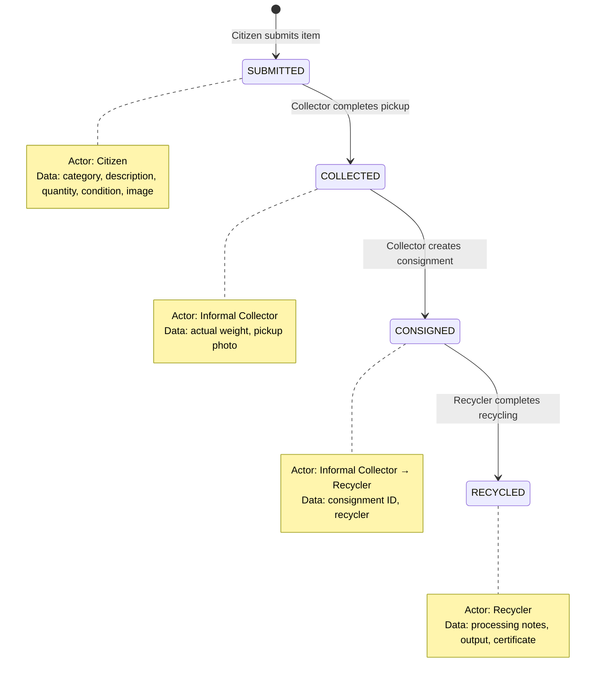

# EcoSetu — Traceability and Audit

> **Reference:** All terminology follows `00_PROJECT_INDEX.md`.

---

## 1. Purpose

Traceability is the platform's core value proposition: the ability to track every e-waste item from citizen submission to recycling completion. This document defines how items move through the ecosystem and how consistency is enforced.

---

## 2. Item Lifecycle



---

## 3. Traceability Events

Each state transition creates a traceable event with the following data:

| Event | Trigger | Actor | Timestamp Source | Data Recorded |
|-------|---------|-------|-----------------|---------------|
| `ITEM_SUBMITTED` | Citizen creates e-waste item | CITIZEN | `ewaste_items.created_at` | Category, quantity, condition, image, AI prediction (if any) |
| `REQUEST_SUBMITTED` | Citizen submits collection request | CITIZEN | `collection_requests.submitted_at` | Pickup address, preferred time, item list |
| `REQUEST_ACCEPTED` | Collector accepts request | INFORMAL_COLLECTOR | `collection_requests.accepted_at` | Collector ID |
| `PICKUP_COMPLETED` | Collector confirms pickup | INFORMAL_COLLECTOR | `pickups.completed_at` | Actual weights, collector notes, pickup photo |
| `CONSIGNMENT_CREATED` | Collector creates consignment to recycler | INFORMAL_COLLECTOR | `consignments.created_at` | Recycler ID, item list, total weight |
| `CONSIGNMENT_ACCEPTED` | Recycler accepts consignment | RECYCLER | `consignments.accepted_at` | — |
| `RECYCLING_STARTED` | Recycler begins processing | RECYCLER | `recycling_records.processing_started_at` | — |
| `RECYCLING_COMPLETED` | Recycler completes recycling | RECYCLER | `recycling_records.completed_at` | Processing notes, output description, certificate |

---

## 4. Traceability Chain Construction

### 4.1 How the Chain is Built

The traceability chain for an item is constructed by querying across related tables:

```
ewaste_items
  → collection_requests (via collection_request_id)
    → pickups (via collection_request_id)
  → consignment_items (via ewaste_item_id)
    → consignments (via consignment_id)
      → recycling_records (via consignment_id)
```

### 4.2 Traceability API Response

`GET /api/v1/ewaste-items/:id/traceability` returns:

```json
{
  "item": {
    "id": "uuid",
    "category": "LAPTOP",
    "description": "Old HP laptop",
    "quantity": 1,
    "createdAt": "2024-01-15T10:00:00Z"
  },
  "events": [
    {
      "event": "ITEM_SUBMITTED",
      "timestamp": "2024-01-15T10:00:00Z",
      "actor": { "name": "Rahul Sharma", "role": "CITIZEN" },
      "details": { "category": "LAPTOP", "condition": "DAMAGED" }
    },
    {
      "event": "PICKUP_COMPLETED",
      "timestamp": "2024-01-16T14:30:00Z",
      "actor": { "name": "Amit Kumar", "role": "INFORMAL_COLLECTOR" },
      "details": { "actualWeightKg": 2.5 }
    },
    {
      "event": "CONSIGNMENT_ACCEPTED",
      "timestamp": "2024-01-17T09:00:00Z",
      "actor": { "name": "GreenTech Recyclers", "role": "RECYCLER" },
      "details": {}
    },
    {
      "event": "RECYCLING_COMPLETED",
      "timestamp": "2024-01-20T16:00:00Z",
      "actor": { "name": "GreenTech Recyclers", "role": "RECYCLER" },
      "details": { "outputDescription": "Metals extracted, plastics separated" }
    }
  ],
  "isComplete": true
}
```

`isComplete` = true when the item reaches `RECYCLED` status.

---

## 5. Audit Logging

### 5.1 Audit Log Structure

Audit logs complement traceability by recording ALL significant platform events (not just item lifecycle).

| Field | Description |
|-------|-------------|
| `action` | What happened (canonical event name) |
| `entity_type` | What entity was affected |
| `entity_id` | ID of affected entity |
| `actor_id` | Who performed the action |
| `details` | JSON with additional context |
| `ip_address` | Request IP |
| `created_at` | Immutable timestamp |

### 5.2 Audit Log Events

| Action | Entity Type | Trigger |
|--------|------------|---------|
| `USER_REGISTERED` | `users` | New registration |
| `USER_LOGIN` | `users` | Successful login |
| `USER_LOGIN_FAILED` | `users` | Failed login attempt |
| `USER_VERIFIED` | `verifications` | Admin approves |
| `USER_REJECTED` | `verifications` | Admin rejects |
| `USER_SUSPENDED` | `users` | Admin suspends |
| `USER_REACTIVATED` | `users` | Admin reactivates |
| `ITEM_SUBMITTED` | `ewaste_items` | Citizen creates item |
| `REQUEST_SUBMITTED` | `collection_requests` | Request submitted |
| `REQUEST_ACCEPTED` | `collection_requests` | Collector accepts |
| `REQUEST_CANCELLED` | `collection_requests` | Request cancelled |
| `PICKUP_STARTED` | `pickups` | Collector starts |
| `PICKUP_COMPLETED` | `pickups` | Collector completes |
| `CONSIGNMENT_CREATED` | `consignments` | Collector creates |
| `CONSIGNMENT_ACCEPTED` | `consignments` | Recycler accepts |
| `CONSIGNMENT_REJECTED` | `consignments` | Recycler rejects |
| `RECYCLING_STARTED` | `recycling_records` | Processing begins |
| `RECYCLING_COMPLETED` | `recycling_records` | Processing complete |
| `AI_PREDICTION` | `ai_predictions` | Model inference |
| `AI_FEEDBACK` | `ai_predictions` | User accepts/overrides |

### 5.3 Integrity Rules

1. **Append-only:** No UPDATE or DELETE operations on `audit_logs`
2. **Server timestamps:** `created_at` set by database `now()`, not by application
3. **Non-repudiation:** Every entry links to the acting user
4. **No sensitive data in details:** Never log passwords, tokens, or full documents

---

## 6. Inconsistency Detection

### 6.1 Potential Inconsistencies

| Inconsistency | How It Could Happen | Detection |
|---------------|-------------------|-----------|
| Item status doesn't match related records | Bug in status update logic | Periodic query: items with status `SUBMITTED` but existing pickup records |
| Pickup weight > reasonable maximum | Data entry error | Validation: flag pickups with total weight > 100kg |
| Item in multiple active consignments | Race condition | Database constraint: unique active consignment per item |
| Recycling record without accepted consignment | Bypassed workflow | Query: recycling records where consignment status ≠ `ACCEPTED` |
| Timeline gaps | Collector reported pickup but never created consignment | Admin dashboard: old `COLLECTED` items without consignments |

### 6.2 Prevention Mechanisms

| Mechanism | Implementation |
|-----------|---------------|
| **Database constraints** | UNIQUE, FK, CHECK constraints prevent invalid data |
| **Status validation** | Service layer verifies current status before transitions |
| **Transactions** | Multi-step operations wrapped in database transactions |
| **Business rules** | Service layer enforces rules (e.g., only COLLECTED items can be consigned) |
| **Audit trail** | Complete event log enables post-hoc investigation |

### 6.3 Admin Tools

The admin can detect and investigate inconsistencies through:

1. **Audit Log Viewer** — Filter by action, entity, date range
2. **Analytics Dashboard** — Spot anomalies in conversion rates
3. **User Management** — Suspend accounts involved in suspicious activity

---

## 7. Why Not Blockchain?

| Argument for Blockchain | Counter-Argument |
|------------------------|-------------------|
| "Immutable ledger" | Append-only database table + audit logs provide immutability for this scale |
| "Decentralized trust" | All participants use the same platform; decentralization adds complexity without benefit |
| "Tamper-proof" | Server-side controls + database integrity sufficient for prototype; blockchain wouldn't prevent application-level fraud |
| "Smart contracts" | Business rules are better expressed in application code for a prototype |

**Bottom line:** Blockchain adds significant complexity (consensus, gas fees, wallet management, latency) without providing tangible benefits over a well-designed relational database with audit logging at this scale.

If the platform scales to a multi-organization, regulatory-grade system, blockchain can be evaluated then.

---

*All terminology in this document follows `00_PROJECT_INDEX.md`.*
